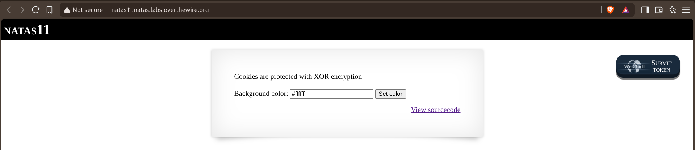
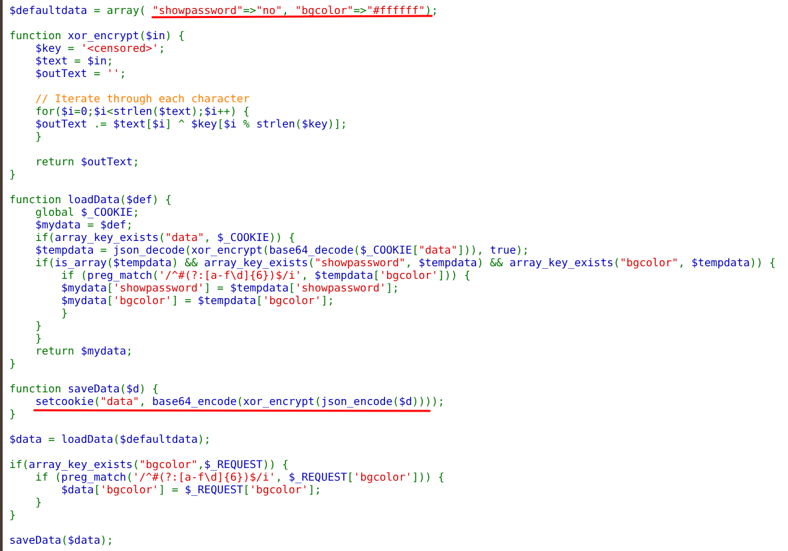
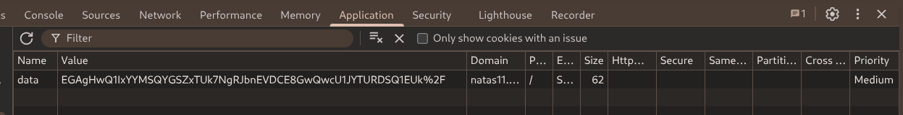
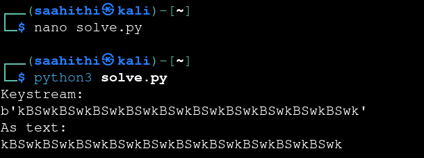
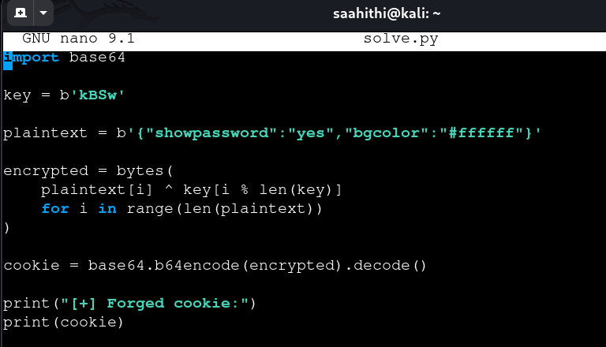
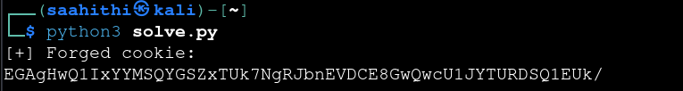
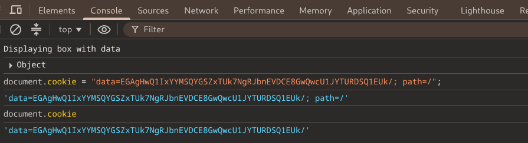
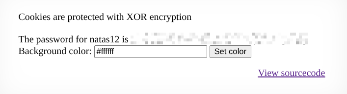

# Natas — Level 11 → 12

**Category:** OverTheWire / Natas  
**Difficulty:** Medium  
**Date:** 2026-08-21  
**Level page:** [natas11.html](https://overthewire.org/wargames/natas/natas11.html)

## Goal

A background-color form, with a note about how the state is stored:

    Cookies are protected with XOR encryption

## Solution

The source showed exactly how the `data` cookie is built:

    $defaultdata = array( "showpassword"=>"no", "bgcolor"=>"#ffffff");

    function xor_encrypt($in) {
        $key = '<censored>';
        $text = $in;
        $outText = '';
        for($i=0;$i<strlen($text);$i++) {
            $outText .= $text[$i] ^ $key[$i % strlen($key)];
        }
        return $outText;
    }

    function saveData($d) {
        setcookie("data", base64_encode(xor_encrypt(json_encode($d))));
    }

The cookie is just `base64(xor(json_encode($data), $key))`, and the key itself is repeating and hidden — but the *default* plaintext (`{"showpassword":"no","bgcolor":"#ffffff"}`) is known from the source. XOR is symmetric, so `encrypted_default ^ known_plaintext_default` recovers the repeating key directly, without ever knowing it in advance.

Grabbed the actual `data` cookie value from DevTools → Application:

Base64-decoded that cookie and XORed it against the known default JSON to recover the keystream — it repeated every 4 bytes:

    Keystream: b'kBSwkBSwkBSwkBSwkBSwkBSwkBSwkBSw...'
    As text:   kBSw

With the real key known, wrote a small script to forge a new cookie with `showpassword` flipped to `"yes"`, XOR-encrypted with `kBSw` and base64-encoded the same way `saveData()` does:

    key = b'kBSw'
    plaintext = b'{"showpassword":"yes","bgcolor":"#ffffff"}'
    encrypted = bytes(plaintext[i] ^ key[i % len(key)] for i in range(len(plaintext)))
    cookie = base64.b64encode(encrypted).decode()

Running it produced the forged cookie value:

    [+] Forged cookie:
    EGAgHwQ1IxYYMSQYGSZxTUk7NgRJbnEVDCE8GwQwcU1JYTURDSQ1EUk/

Set it directly via the DevTools console and reloaded the page:

    document.cookie = "data=EGAgHwQ1IxYYMSQYGSZxTUk7NgRJbnEVDCE8GwQwcU1JYTURDSQ1EUk/; path=/";

The page came back with `showpassword` honored:

    The password for natas12 is [REDACTED]

## Result

    Password for natas12: [REDACTED]

## Key Takeaway

XOR encryption with a fixed repeating key is only as strong as the key's secrecy — and a known default plaintext breaks that instantly. Since `ciphertext = plaintext ^ key`, having one matching pair (`encrypted_default` and the known default JSON) recovers the key via `encrypted_default ^ known_plaintext`, which is enough to forge any other cookie value from scratch.
