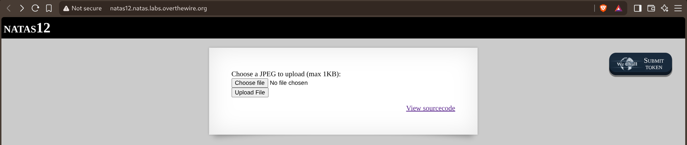
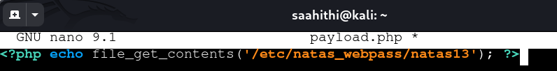
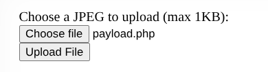
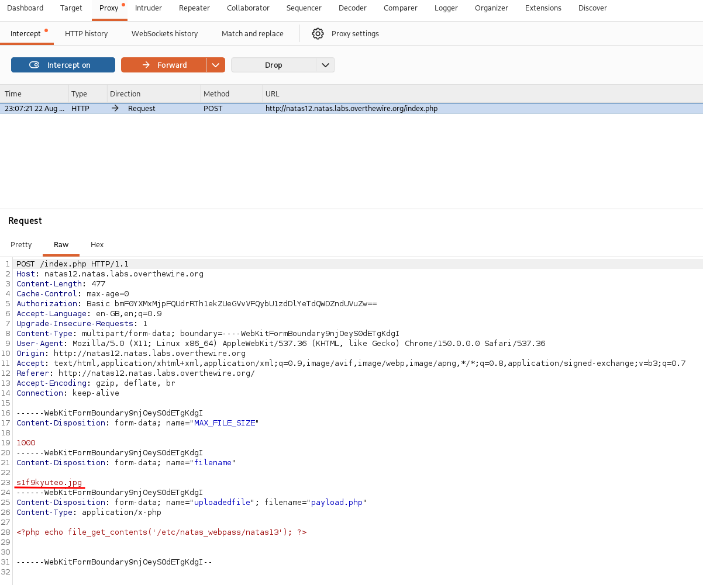
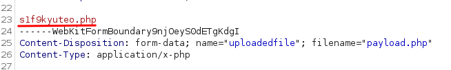
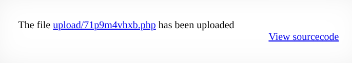

# Natas — Level 12 → 13

**Category:** OverTheWire / Natas  
**Difficulty:** Medium  
**Date:** 2026-08-22

## Goal

A file upload form with a client-side restriction:

    Choose a JPEG to upload (max 1KB)

## Solution

Wrote a small PHP payload to read the next password:

    <?php echo file_get_contents('/etc/natas_webpass/natas13'); ?>

The source showed how the upload actually decides where to save the file:

    function makeRandomPathFromFilename($dir, $fn) {
        $ext = pathinfo($fn, PATHINFO_EXTENSION);
        return makeRandomPath($dir, $ext);
    }

    if(array_key_exists("filename", $_POST)) {
        $target_path = makeRandomPathFromFilename("upload", $_POST["filename"]);

        if(filesize($_FILES['uploadedfile']['tmp_name']) > 1000) {
            echo "File is too big";
        } else {
            if(move_uploaded_file($_FILES['uploadedfile']['tmp_name'], $target_path)) {
                echo "The file <a href=\"$target_path\">$target_path</a> has been uploaded";
            } ...

![Source showing makeRandomPathFromFilename() taking its extension from $_POST["filename"]](images/natas-12-13-source.png)

The extension used for the saved file comes from a separate `filename` POST field, not from the actual uploaded file's own name — only the file size is checked, nothing validates that it's really a JPEG. Selected `payload.php` in the upload form:

Intercepted the request in Burp before it went out. Two different filenames were present: the `filename` field (`s1f9kyuteo.jpg`, which controls the saved extension) and the actual uploaded file's own name (`payload.php`, which doesn't matter to the server):

Changed just the `filename` field's extension from `.jpg` to `.php`, leaving the uploaded file's PHP content untouched, then forwarded it:

The server saved it with the `.php` extension since that's the only part it trusted:

    The file upload/71p9m4vhxb.php has been uploaded

Visited that path directly, which executed the uploaded PHP and ran the `file_get_contents()` call:

## Result

    Password for natas13: [REDACTED]

## Key Takeaway

Restricting uploads to "JPEG only" only means something if the server actually validates the file's content or its own filename — here the extension came from a separate, attacker-controlled `filename` field that never touched the real upload at all. Changing one form field's value in Burp was enough to save arbitrary PHP to a web-accessible path and get it executed.
