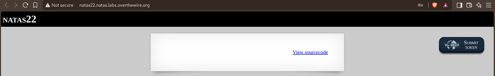
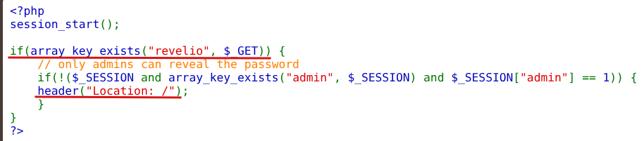
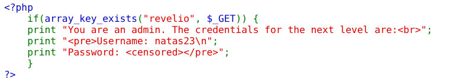
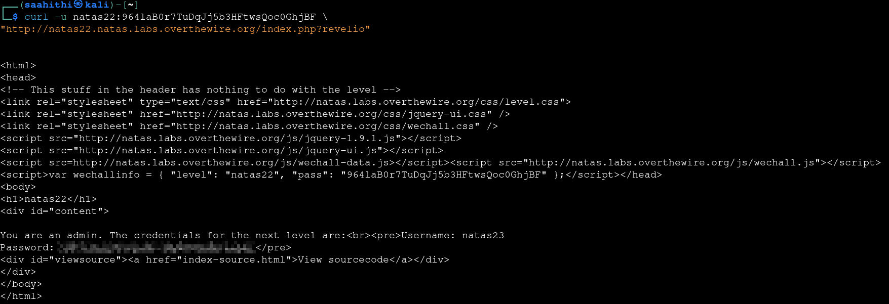

# Natas — Level 22 → 23

**Category:** OverTheWire / Natas  
**Difficulty:** Medium  
**Date:** 2026-08-28

## Goal

An almost entirely blank page — just a "View sourcecode" link:

## Solution

The source showed a `revelio` parameter guarding the credentials with a redirect:

    session_start();

    if(array_key_exists("revelio", $_GET)) {
        // only admins can reveal the password
        if(!($_SESSION and array_key_exists("admin", $_SESSION) and $_SESSION["admin"] == 1)) {
            header("Location: /");
        }

Right after that redirect call, the same block just keeps going:

        print "You are an admin. The credentials for the next level are: ";
        print "<pre>Username: natas23\n";
        print "Password: <censored></pre>";
    }

`header("Location: /")` only queues a redirect response header — it doesn't stop the script. PHP keeps executing everything after it unless there's an explicit `exit`/`die`, and there isn't one here. So even when the admin check fails, the credentials still get printed into the response body; a browser just never shows them because it immediately follows the redirect. A client that doesn't auto-follow redirects sees the body anyway. `curl` doesn't follow redirects by default, so no session, login, or admin flag was needed at all:

    curl -u natas22:<password> "http://natas22.natas.labs.overthewire.org/index.php?revelio"

    You are an admin. The credentials for the next level are:
    Username: natas23
    Password: [REDACTED]

## Result

    Username for natas23: natas23
    Password for natas23: [REDACTED]

## Key Takeaway

`header("Location: ...")` is just an HTTP header — it's a hint for the client to navigate away, not a way to stop PHP from running. Any sensitive output written after a redirect call still executes and still ships in the response body unless the code explicitly calls `exit` right after. Browsers hide that behind the redirect; anything that doesn't auto-follow (`curl` by default, `requests` in Python, etc.) reads it straight through.
