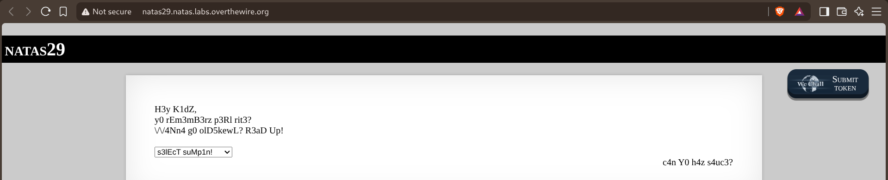
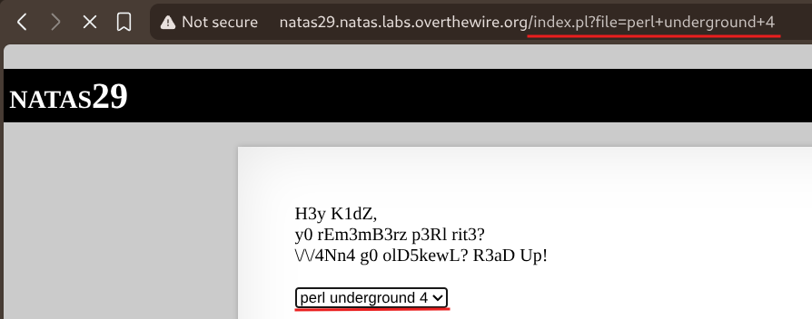
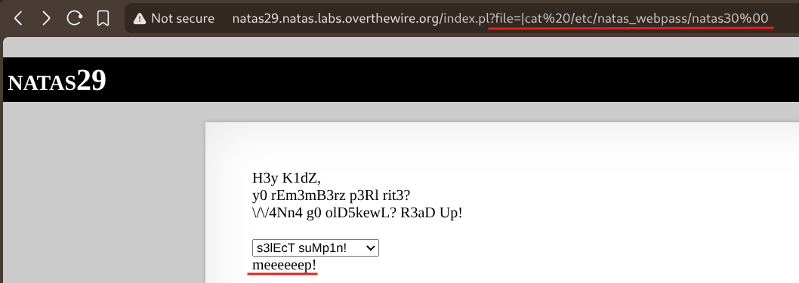
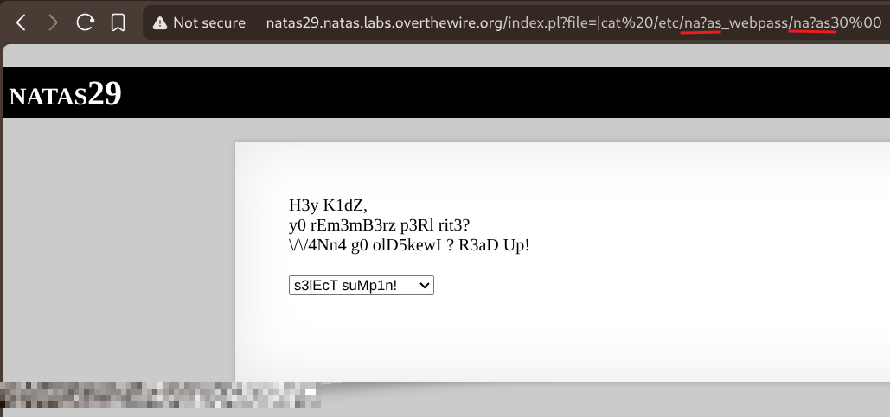

# Natas — Level 29 → 30

**Category:** OverTheWire / Natas  
**Difficulty:** Hard  
**Date:** 2026-08-31

## Goal

A leetspeak-y joke page, this time backed by Perl instead of PHP:

    H3y K1dZ,
    y0 rEm3mB3rz p3Rl rit3?
    VV4Nn4 g0 olD5kewL? R3aD Up!

    [s3lEcT suMp1n! ▾]

    c4n Y0 h4z s4uc3?

## Solution

No source link was offered this time, so the endpoint itself had to be probed. Picking a joke from the dropdown showed how it worked:

    natas29.natas.labs.overthewire.org/index.pl?file=perl+underground+4

A `file` parameter feeding straight into a Perl script strongly suggested the classic Perl `open()` quirk: a two-argument `open(FH, $file)` doesn't just open a file — if `$file` starts with `|`, Perl runs it as a shell command instead and pipes the output back. Tried exactly that, along with a trailing null byte in case the script appends something to the filename:

    index.pl?file=|cat%20/etc/natas_webpass/natas30%00

    meeeeep!

That got blocked outright — almost certainly a blacklist on the literal string `natas_webpass`, the same pattern seen in earlier levels. Since the command still runs through a real shell once Perl pipes to it, shell glob characters get expanded there rather than matched literally against any blacklist the script itself checks. Swapping a couple of letters in the blocked words for `?` (which matches any single character in shell globbing) kept the path resolving to the same real file while no longer containing the banned substring:

    index.pl?file=|cat%20/etc/na?as_webpass/na?as30%00

The shell expanded `na?as_webpass/na?as30` back into the literal path `natas_webpass/natas30` at execution time, and `cat` returned its contents straight into the page.

## Result

    Password for natas30: [REDACTED]

## Key Takeaway

Perl's two-argument `open()` treating a leading `|` as "run this as a command" is a well-known trap, but even once command execution is confirmed, a naive substring blacklist can still be bypassed if the resulting command string is later interpreted by a real shell — glob wildcards like `?` and `*` get expanded *after* the blacklist check runs, so a path can dodge the filter in its literal form while still resolving to the exact file being blocked.
