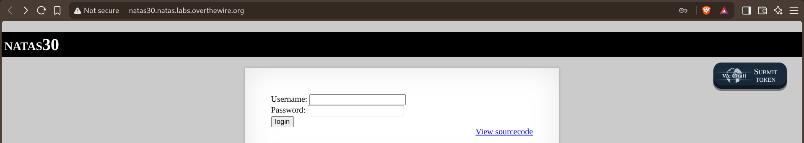
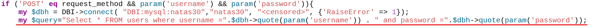
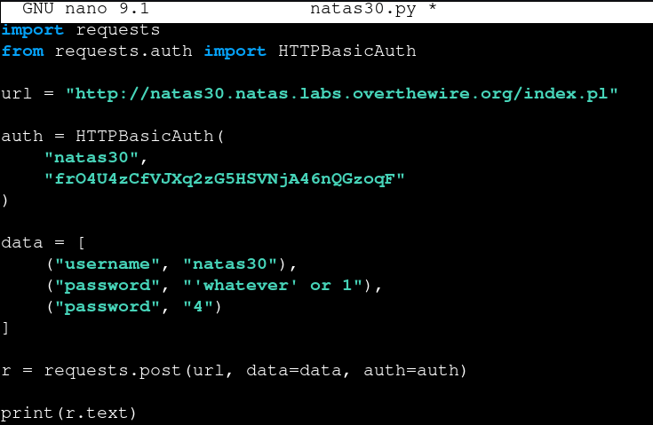
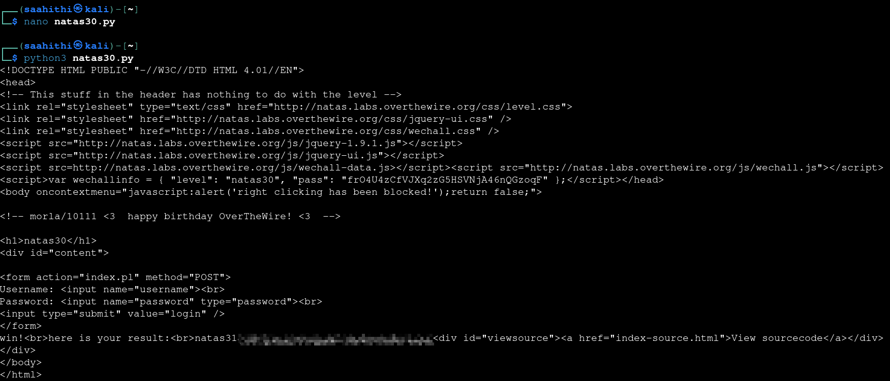

# Natas — Level 30 → 31

**Category:** OverTheWire / Natas  
**Difficulty:** Hard  
**Date:** 2026-08-31

## Goal

Another Perl-backed login form:

    Username: [___________]
    Password: [___________]
    [login]

## Solution

The source used Perl's DBI module, quoting both fields before building the query:

    if ('POST' eq request_method && param('username') && param('password')){
        my $dbh = DBI->connect("DBI:mysql:natas30","natas30", "<censored>", {'RaiseError' => 1});
        my $query="Select * FROM users where username =".$dbh->quote(param('username')) . " and password =".$dbh->quote(param('password'));

`$dbh->quote()` looks safe — it's DBI's own escaping function, not raw string concatenation. But `quote()` actually accepts a *second* argument: an optional SQL data type, and when that type is numeric, DBI treats the value as already-safe and returns it **unquoted and unescaped** instead of wrapping it in `'...'`. The other half of the bug is in `param('password')` itself — CGI's `param()` returns every submitted value for a repeated field name when called in list context, not just the first. Sending `password` *twice* in the same POST body means `param('password')` doesn't return one string, it returns a list — and that list lands directly as `quote($value, $type)`'s two arguments instead of a single quoted string.

Sent `password` twice: once with the actual injection payload, and once with `4` (DBI's numeric bind-type constant) right after it:

    data = [
        ("username", "natas30"),
        ("password", "'whatever' or 1"),
        ("password", "4")
    ]

    r = requests.post(url, data=data, auth=auth)

`param('password')` returned `("'whatever' or 1", "4")`, which `quote()` interpreted as *(value, type)* — type `4` telling it to skip quoting entirely. The resulting query became:

    Select * FROM users where username='natas30' and password='whatever' or 1

`or 1` makes the `WHERE` clause true for every row, logging in without ever needing the real password:

    win!
    here is your result:
    natas31 [REDACTED]

## Result

    Username for natas31: natas31
    Password for natas31: [REDACTED]

## Key Takeaway

Calling an escaping function isn't automatically safe if that function accepts more arguments than expected and the input feeding it can supply extras. HTTP parameter pollution (submitting the same field name more than once) is exactly the kind of input that turns a single expected string into a list when a framework's parameter accessor is called in list context — here, quietly redirecting the second value into `quote()`'s data-type argument and disabling escaping altogether.
