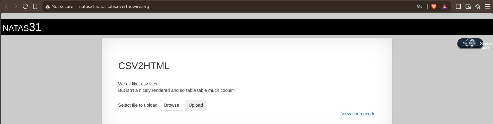
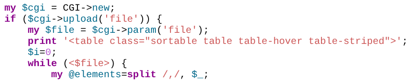
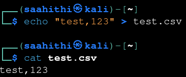
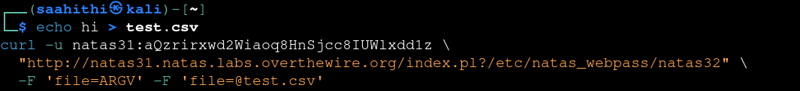
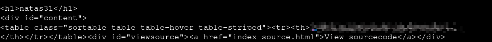

# Natas — Level 31 → 32

**Category:** OverTheWire / Natas  
**Difficulty:** Hard  
**Date:** 2026-08-31

## Goal

A CSV-to-HTML-table converter:

    CSV2HTML
    We all like .csv files.
    But isn't a nicely rendered and sortable table much cooler?
    Select file to upload: [Browse] [Upload]

## Solution

The source read the uploaded file and split it line by line:

    my $cgi = CGI->new;
    if ($cgi->upload('file')) {
        my $file = $cgi->param('file');
        print '<table class="sortable table table-hover table-striped">';
        $i=0;
        while (<$file>) {
            my @elements=split /,/, $_;

Confirmed normal behavior first with a plain local CSV:

    $ echo "test,123" > test.csv
    $ cat test.csv
    test,123

Two things stood out in the code. First, `$cgi->param('file')` in scalar context only returns the *first* value submitted for a repeated field name — so if `file` is sent twice, once as an ordinary text value and once as the actual upload, `$file` ends up holding whatever plain string came first, not the upload's filehandle. Second, `while (<$file>)` — Perl's diamond operator on a scalar containing a bareword-like string does a symbolic filehandle lookup, and `"ARGV"` specifically resolves to Perl's built-in `@ARGV`-driven filehandle, the same one `<>` reads from in a script invoked with file arguments on the command line.

CGI.pm also has an old ISINDEX-style behavior: a query string with no `=` in it gets parsed as a plain keyword list and pushed straight into `@ARGV` rather than into normal named parameters. Put together: give the script a query string that's just a raw file path (populating `@ARGV` with it), then submit `file` twice — once as the literal text `"ARGV"`, once as a real (harmless) upload to satisfy the `$cgi->upload('file')` check:

    curl -u natas31:<password> \
      "http://natas31.natas.labs.overthewire.org/index.pl?/etc/natas_webpass/natas32" \
      -F 'file=ARGV' -F 'file=@test.csv'

`$cgi->upload('file')` sees the genuine upload and passes the check, but `$file = $cgi->param('file')` grabs the *first* submitted value — the string `"ARGV"` — instead of the upload. `while (<"ARGV">)` then resolves symbolically to Perl's actual `ARGV` filehandle, which reads from whatever's in `@ARGV` — the file path smuggled in through the query string. The response table came back with the target file's contents as its row:

## Result

    Password for natas32: [REDACTED]

## Key Takeaway

Two independent Perl/CGI quirks chained into arbitrary file read: `param()` silently collapsing a repeated field down to its first value in scalar context, and a bare scalar string being usable as a symbolic filehandle name — with `"ARGV"` in particular tied to Perl's own command-line-file-reading machinery, which CGI.pm's legacy keyword-query-string parsing could be abused to populate. Neither behavior looks dangerous in isolation; together they turn a file-upload feature into a path to reading any file the web server process can access.
