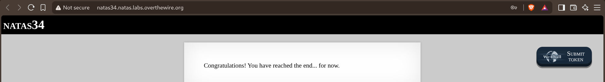

# Natas

Natas is OverTheWire's web security wargame. Each level is a small website, and the goal never changes — find the password to the next level, usually buried in source code, cookies, headers, or an actual vulnerability (SQLi, XSS, path traversal, deserialization, and further afield).

## Progress

| Level | Writeup | Status |
| :---: | :-----: | :----: |
| 0 → 1 | Level-00-01.md | ✅ |
| 1 → 2 | Level-01-02.md | ✅ |
| 2 → 3 | Level-02-03.md | ✅ |
| 3 → 4 | Level-03-04.md | ✅ |
| 4 → 5 | Level-04-05.md | ✅ |
| 5 → 6 | Level-05-06.md | ✅ |
| 6 → 7 | Level-06-07.md | ✅ |
| 7 → 8 | Level-07-08.md | ✅ |
| 8 → 9 | Level-08-09.md | ✅ |
| 9 → 10 | Level-09-10.md | ✅ |
| 10 → 11 | Level-10-11.md | ✅ |
| 11 → 12 | Level-11-12.md | ✅ |
| 12 → 13 | Level-12-13.md | ✅ |
| 13 → 14 | Level-13-14.md | ✅ |
| 14 → 15 | Level-14-15.md | ✅ |
| 15 → 16 | Level-15-16.md | ✅ |
| 16 → 17 | Level-16-17.md | ✅ |
| 17 → 18 | Level-17-18.md | ✅ |
| 18 → 19 | Level-18-19.md | ✅ |
| 19 → 20 | Level-19-20.md | ✅ |
| 20 → 21 | Level-20-21.md | ✅ |
| 21 → 22 | Level-21-22.md | ✅ |
| 22 → 23 | Level-22-23.md | ✅ |
| 23 → 24 | Level-23-24.md | ✅ |
| 24 → 25 | Level-24-25.md | ✅ |
| 25 → 26 | Level-25-26.md | ✅ |
| 26 → 27 | Level-26-27.md | ✅ |
| 27 → 28 | Level-27-28.md | ✅ |
| 28 → 29 | Level-28-29.md | ✅ |
| 29 → 30 | Level-29-30.md | ✅ |
| 30 → 31 | Level-30-31.md | ✅ |
| 31 → 32 | Level-31-32.md | ✅ |
| 32 → 33 | Level-32-33.md | ✅ |
| 33 → 34 | Level-33-34.md | ✅ |

Level 33→34 was the last one: PHAR deserialization to get code execution past a hardcoded, unbrute-forceable MD5 check. A fitting way to close it out.

**34/34 levels — Natas complete.**

